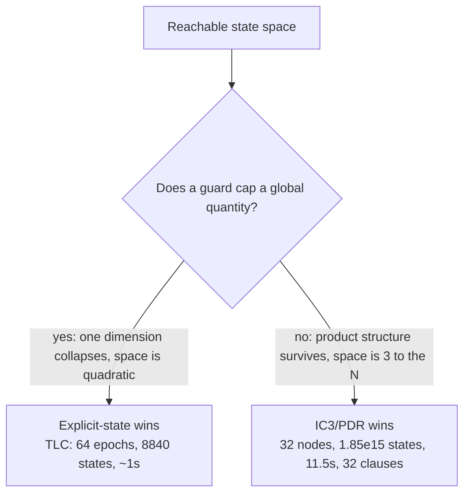

# A Cap Makes Brute Force Win

We aimed our own IC3/PDR model checker at the split-brain proof expecting it to beat explicit-state enumeration. It lost — because the lease guard caps one quantity, and that collapses the space brute force has to search.

<!-- more -->

The [quorum-types arc](split-brain-unrepresentable.md) ended on an open question. We had a TLA+ model of the one failure the type system couldn't rule out — two leaders serving at once, a split-brain the epoch types made *unrepresentable* but not *unreachable* — and a hand-written lease guard that closes it. [The last post](where-structure-ends.md) asked whether any of this survives contact with a real protocol. A more immediate question came first: we have a symbolic model checker of our own — the IC3/PDR engine in the warp-types verification stack, a sibling of the SAT and SMT solvers there. What happens if we point it at the model TLC already checked?

The answer split into three findings, and only the first was the one we went looking for.

## Two engines, one verdict

The split-brain model has four state variables — a monotonic `epoch`, two liveness flags, the epochs each half was minted at, and `serving`, the set of epochs whose leader still believes it is authoritative. Safety is one line: `NoSplitBrain == Cardinality(serving) <= 1`. The load-bearing guard is a single precondition on forming a new leader — you may not form while any prior leader is still serving.

TLC, the explicit-state checker for TLA+, does what explicit-state checkers do: it enumerates every reachable state. With the guard on and the model bounded to three epochs, it clears 36 states and reports safety. Remove the guard as a negative control and it finds a violation at depth four — `Form(0) → Reconfigure → Form(1)`, ending in `serving = {0, 1}`.

To feed the same model to a propositional IC3/PDR engine you have to bit-blast it: every integer becomes a fixed-width bit vector, every action becomes a guarded selector, the whole transition relation becomes CNF. Twenty-one boolean state variables later, PDR returns the same two verdicts. Guarded: safe, with an inductive invariant found at frame two. Guard removed: a counterexample on the same three-transition, four-state trace — `Form(0)`, `Reconfigure`, `Form(1)`, `serving = {0, 1}`. (The two tools count that trace differently: TLC reports the state depth, four; PDR the transition count, three. Same trace.)

That agreement is worth something — a SAT-based inductive prover and an explicit-state enumerator reaching the same verdict from encodings with nothing in common isn't leaning on a quirk of either tool. It validates the tools against each other. It does not validate the *model*: both are checking the same TLA+ spec, and a bug in that spec would fool them equally.

## The model checker hands you a lemma

`NoSplitBrain` turns out to be its own inductive invariant. The guard's precondition — form only when `serving` is empty — structurally forbids growing `serving` from any non-empty state, so no state satisfying the property can step to one that violates it. PDR converges to exactly the property, no strengthening needed.

The more interesting case is a property that *isn't* self-inductive. `ServingWithinEpoch` says no leader claims authority for an epoch newer than the current generation — `∀ e ∈ serving: e ≤ epoch`. It's true, but you can't prove it directly: a hypothetical predecessor state with a token minted at a future epoch would let a leader form for an epoch beyond `epoch`, and nothing in the property itself rules that predecessor out. To make it inductive you need a supporting fact — that minted epochs never run ahead of the current one. The TLA+ author wrote that fact by hand, as a separate invariant called `EpochMonotone`.

Ask PDR to prove `ServingWithinEpoch` and it discovers a twenty-clause invariant, seventeen clauses beyond the property. Decode them back into predicates and they say `mintedAt = epoch` in every reachable state — tokens are always minted at the current generation. That is `EpochMonotone`, and in fact strengthened: the human wrote `≤`, PDR found the equality. Nobody told the engine that minted epochs track the current one; it worked out that it needed the fact and found it.

This is the thing explicit-state enumeration cannot give you. TLC will *check* an invariant you hand it. PDR *synthesizes* the one you didn't — and to read it we only had to patch the engine's result type to return the converged frame instead of dropping it. Owning the checker is what made the invariant legible.

## The scaling bet, and its collapse

So far, so encouraging. The next claim seemed obvious enough to state before testing it: IC3/PDR beats explicit-state on scale. TLC has to enumerate reachable states; the split-brain model has a `serving` set over `N` epochs, and a set over `N` elements has `2^N` subsets. Widen the epoch count and TLC should drown in an exponential state space while PDR proves safety from a compact invariant.

It doesn't. Measure TLC's reachable-state count at epoch bounds `E = 2, 8, 16, 32, 64` and you get 36, 216, 680, 2376, 8840 — a clean quadratic, `2E² + 10E + 8`, fitting every point exactly. (The counts are sampled at doubling `E`, not consecutively; the point is the shape.) The `2^N` explosion never happens. TLC clears sixty-four epochs — 8840 states — in about a second. PDR, meanwhile, pays the overhead of symbolic reasoning and grows worse than cubically, taking about a minute at thirty-two epochs. On this model, brute-force enumeration wins outright, and it isn't close.

The reason is the whole point. The `2^N` subsets are the size of the *full* state space. The *reachable* space — what an explicit-state checker actually walks — is quadratic, because the guard caps `serving` at one element. A set that can hold at most one of `N` epochs has `N + 1` reachable values, not `2^N`. The guard that makes split-brain unreachable is the same guard that caps the size of `serving`, and capping `serving` is what flattens the exponential dimension to a linear one.

Sit with which invariant does the work. It is not the *strength* of the safety property — it is that the guard bounds a **global quantity**, the total number of concurrent leaders, and bounding a global quantity collapses the reachable space from a product into a thin slice. A strong safety property that bounds *nothing global* would collapse nothing. So the sharper statement is: **a safety mechanism that caps a global combinatorial quantity is exactly the thing that makes proving safety by brute force cheap.** You would expect a hard safety property to demand a sophisticated prover; instead a *capping* one makes the crude prover suffice and hands the sophisticated one a bill for overhead it never earns back.

## The flip side

If that's the mechanism, it predicts its own converse: a model whose safety invariant is true and strong but caps nothing global — leaving the reachable space a full product — should flip the verdict. So we built the structural inverse.

`N` independent nodes, each cycling through `idle → prepared → committed`, one node stepping per transition. Nothing couples them; every node is independently anywhere in its chain, so the reachable space is `3^N`. The safety property is per-node validity — as true and as "strong" as `NoSplitBrain`, but *local*: it constrains each node and caps no quantity across nodes, so it collapses nothing. The product stands.

This is textbook territory for IC3 — but only if the engine's cube generalization actually works. PDR's power is that when it blocks a bad state it drops the irrelevant bits, learning a fact about one node rather than one full configuration. A from-scratch IC3 whose generalization is weak would block full cubes instead, enumerate exponentially many of them, and blow up exactly like the tool it was supposed to beat.

It doesn't blow up. PDR learns exactly `N` clauses — one per node, every other node's bits generalized away — and its runtime is polynomial in the number of nodes, roughly `N^3.7`. That is the win: at `N = 32` it proves a reachable space of `3^32` — 1.85 × 10¹⁵ states, a quadrillion — safe in 11.5 seconds, from thirty-two clauses. TLC, to reach the same conclusion, must enumerate every one of those states, and it cannot: 43 million states already at sixteen nodes takes minutes, and a quadrillion is not a number you enumerate on any machine in any timeframe. The enumeration never happens because induction makes it unnecessary.

One honest bound on that result. Fully independent nodes are the *friendliest* case for cube generalization — every other node's bits are literally irrelevant, so dropping them is trivial. The experiment shows this engine realizes IC3's asymptotic advantage on a separable product; it says nothing about the harder case, partial coupling, where generalization has to decide which *correlated* bits are safe to drop. That case is untested here.

## What it means for reaching for a tool

Two models is not a population, and one of them was built to order to be the inverse of the other — so this is a discriminant worth naming, not a law proven across a field. But the discriminant is sharp, and you can often read it off a spec before running anything: **does the protocol's safety argument cap a global combinatorial quantity?** A lease that admits one leader, a lock that admits one writer, a quorum rule that bounds concurrent commits — each collapses a dimension, and where a dimension collapses, explicit-state enumeration will often finish before a model checker finishes setting up, on the unmodified spec with no bit-blasting.

The catch is that real specifications are usually *both* regimes at once. A leased protocol caps its leaders — collapse — but also carries a replicated log, message buffers, and per-node timers that combine freely — product. The reachable space is the product of the capped slice and the uncapped one, so a single capping invariant does not make the whole thing cheap to enumerate; it only flattens its own dimension. The heuristic, then, is not "capped or not" but "which dimensions escape capping" — because those are the ones that stay exponential, and those are where IC3/PDR earns its keep and where reading back the invariant it synthesizes turns a green checkmark into something you can put in a proof.

None of this ranks the tools. It names a property of the *system* — the shape of its reachable space, dimension by dimension — that decides which tool wins each dimension. The quorum model taught it to us backwards: we went in to show off the sophisticated tool and left having measured, precisely, the conditions under which the simple one wins. The honest result was the more useful one.

---

🦬☀️ *quorum-types is a feasibility study — a distributed-systems generalization of warp-types. The IC3/PDR engine lives in the warp-types verification stack. [quorum-types](https://github.com/modelmiser/quorum-types) · [warp-types](https://github.com/modelmiser/warp-types).*
