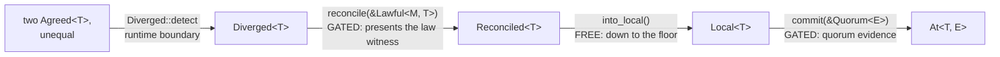

# A Merge Is a Proposal

Two committed values disagree and a certified function merges them. The design's central refusal — the result is not a decision — turns out to be a boundary between two literatures: CRDTs (conflict-free replicated data types), where replicas merge freely, and consensus, where they must agree first. Written as a compile error.

<!-- more -->

## Crossing the line at one point

This is the fifth post on quorum-types, a feasibility study asking whether the compile-time safety of [warp-types](what-the-type-erases-to.md) — typestates for GPU warps — survives the move to a distributed system. quorum-types' consistency lattice tracks how much consensus a value carries: `Local<T>` is a proposal, lifted by quorum evidence to `At<T, E>` (committed at configuration epoch `E`) and freely weakened to `Agreed<T>` (committed, epoch forgotten). The [fourth post](up-is-gated-down-is-free.md) ended by drawing a line: the consistency lattice's last honest gap was that nothing merges two `Agreed<T>` values that disagree, and the toy stopped "exactly where a wire protocol, durability, and reconciliation would begin." This fifth post crosses that line at exactly one of its three points. Reconciliation gets typed; the wire protocol and durability stay on the far side.

The gap is not hypothetical — it follows from one of the fourth post's own caveats. `commit` borrows its witness rather than consuming it, so one `&Quorum<E>` can bless mutually contradictory commits: an `Agreed<i64>` holding `4` and another holding `9` are both honestly constructible from the same configuration, and the lattice as shipped has nothing to say about the pair. Divergence is the residue the fourth post's honesty already admitted was reachable.

Before any code, I wrote the failure mode down: maybe the evidence discipline — up-moves demand a witness, down-moves are free — does not extend here, because reconciliation's interesting content lives entirely in the merge function's *laws*: commutativity, associativity, idempotence — ∀-statements about a function, not facts about any value. If the new types cannot carry anything an ordinary signature doesn't already carry, they are a wrapper with no teeth, and the honest deliverable is a negative result. That bet had a named crux — whether anything *structural* survives when every ingredient is minted at a runtime boundary — and where it resolved is the last thing this post reports.

## A conflict is detected, not declared

Divergence is a fact about values, so — like every other boundary in this crate — the check runs once, at a runtime boundary, and the type carries the verdict afterward:

```rust
impl<T> Diverged<T> {
    pub fn detect(a: Agreed<T>, b: Agreed<T>) -> Detection<T>
    where
        T: PartialEq,
    { /* compare once; wrap the verdict */ }
}
```

`Detection` is a two-armed verdict: `Consistent(Agreed<T>)` when the values were equal — no conflict, hand back the single agreed value — or `Diverged(Diverged<T>)` when they differ. `Diverged<T>` is move-only, `#[must_use]`, private-field, no public constructor: two committed values known to disagree, packaged as a conflict you cannot *resolve* until evidence lifts it. It is the bottom of a new path, the analogue of `Local` one module over. Giving divergent replica state a typed container is Gallifrey's move — a research language whose *branch* construct (Milano et al., SNAPL 2019) confines provisional, conflicting state at the language level until it is explicitly merged back. What this module adds to that shape is what happens next: the exit is gated on evidence about the merge function itself.

## An open trait is why the gate exists

The merge function is deliberately the least trusted object in the module:

```rust
pub trait Merge<T> {
    /// Combine two conflicting values into one.
    fn merge(&self, a: &T, b: &T) -> T;
}
```

An open trait — anyone can implement it, with any function whatsoever, and nothing about the signature says the function is sane. That openness is not an oversight; it is the design reason the gate exists. Because anyone can write a `Merge`, *using* one requires a witness, and `Lawful::certify` is the runtime boundary that mints it:

```rust
impl<M, T> Lawful<M, T>
where
    M: Merge<T>,
    T: PartialEq,
{
    pub fn certify(merge: M, samples: &[T]) -> Result<Self, LawViolation>
}
```

It checks the three join-semilattice laws — idempotence, then commutativity, then associativity — over every combination drawn from the samples, and mints a `Lawful<M, T>` only if no counterexample turns up. It also refuses the vacuous case — zero samples mint nothing — though one sample is accepted, and one sample proves almost as little — a loophole with its own reckoning below. The witness *holds* the merge function as a private field: a certified merge is spent through its certificate, and `reconcile` accepts only `&Lawful<M, T>`, so, in safe code outside the crate, nothing uncertified can ever *produce* a `Reconciled` — the badge type introduced below. What that guarantee does — and does not — buy is bounded after the finding.

Say plainly what this witness is, because it is weaker than it looks. Sampling cannot establish a ∀-law: `Lawful` certifies "no counterexample found on these samples," not "lawful," and it cannot exclude a function whose violations the samples happened to miss. The sound version of this exists and deserves the prominent citation: **Propel** (Zakhour, Weisenburger, Salvaneschi, PLDI 2023) carries commutativity, associativity, and idempotence of merge functions *in types*, discharged by the type checker itself via built-in induction, at compile time — laws as static facts, not sampled ones. This module is the deliberately cheaper runtime-boundary variant of that idea, and says so: a property check at the edge instead of a prover, buying reach at the price of soundness.

The witness mechanism is the one the [fourth post](up-is-gated-down-is-free.md) traced to Noonan's *Ghosts of Departed Proofs*; Haskell's `refined` and Alexis King's "parse, don't validate" are the packaged per-value forms of the same move — check a predicate about *this value*, wrap it in a type that remembers. A witness whose content is a sampled ∀-law about a *function* is the same move pointed at a different object. I found no name for that variant in the literature — not a novelty claim, just an honest report that the search came back empty.

## One counterexample per law

Property-testing CRDT merge laws is routine — Rust's `cvrdt-exposition` property-tests exactly these laws, and rust-crdt's README states the merge laws in prose (idempotence as a derived note). The difference here is only that the passing check *mints* something: there, the green test result is discarded; here it becomes a value the rest of the program spends. But taking the check seriously as a mint imposes a design obligation the throwaway version never faces, and it is the module's best small lesson.

`certify` checks the laws in a fixed order — idempotence over `n` samples, commutativity over `n²` pairs, associativity over `n³` triples, cheapest first — and `LawViolation` reports the *first* law broken. That makes the negative controls subtle. A test that certifies a good merge (`max` passes over `[0, 1, 2, 5, -3]`) proves little; the boundary earns trust by *rejecting*, and rejecting for the right reason. Each law needs its own counterexample operation, and each counterexample must *pass every law checked before its target* — otherwise `certify` reports the earlier law and the control asserting its target goes red.

Addition fails idempotence at the first nonzero sample (`a + a ≠ a`). First-projection — `merge(a, b) = a` — is idempotent but not commutative. And integer midpoint, `(a + b) / 2` — write it `@` — is idempotent and commutative but not associative, with a counterexample small enough to do in your head: `(1 @ 1) @ 5` is `1 @ 5 = 3`, but `1 @ (1 @ 5)` is `1 @ 3 = 2`. Three and two. One operation per law, each shaped to survive the gauntlet up to exactly its target. The check order itself is contractual — `LawViolation` names the *first* law broken — and a fourth control pins it: subtraction, which breaks all three laws and must report idempotence.

## The refusal that names a boundary

Everything so far is mechanics. Here is the finding the post is named for.

`reconcile` consumes the conflict — `self` by value, so merging the same `Diverged` twice is a use-after-move — demands the law witness for the same value type, and applies the certified merge:

```rust
pub fn reconcile<M>(self, law: &Lawful<M, T>) -> Reconciled<T>
where
    M: Merge<T>,
```

No check runs here; like `commit`, it spends evidence minted at the earlier boundary. `Reconciled<T>` is unforgeable in the now-familiar way — private field, no public constructor, in safe code outside the crate — and possession proves a lawfulness check ran. That is what the badge buys: an API that accepts only lawfully-merged resolutions says so in its signature — take a `Reconciled<T>` — and every caller is compiler-checked to have come through a certify, with exactly the trust model certification carries. The natural next design step would be to make `Reconciled` implement `Committed` — the merged value came from two committed inputs through a certified function, surely it has earned committed standing.

It has not, and the module's most deliberate line of code is the absence of that `impl`. Handing a `Reconciled` to any consumer that demands committed evidence is rejected with the same error the fourth post used to keep proposals out:

```text
error[E0277]: the trait bound `Reconciled<i64>: Committed` is not satisfied
```

The only consuming exit is `into_local` — a read accessor exists, as on `Diverged` — and it goes *down*:

```rust
pub fn into_local(self) -> Local<T>
```

Back to the lattice floor. The reasoning is short: no quorum witnessed the merged value *as the resolution of this conflict*. The inputs were witnessed — separately, as competing commits; the *function* was certified; but no majority ever endorsed the output as the value that settles the pair. (With `max` the merged value even *is* one of the witnessed inputs — which changes nothing: what was witnessed was a proposal, not a resolution.) Evidence about a function is not evidence about consensus, and the crate's whole discipline is that consensus strength is minted at exactly one boundary — `commit`, spending a `&Quorum<E>`. A merge is therefore a proposal, not a decision. It is an *application* for truth that must clear a quorum again, with every one of the [fourth post's](up-is-gated-down-is-free.md) caveats — witnessing rather than voting, the `Config::new` root of trust the types cannot vouch for — attached to the re-commit unchanged.



*The arrows are moves, each consuming its input (the two witnesses are only borrowed) — not the lattice ordering. In strength, `Reconciled` sits below everything committed; the only way back up is through `commit`.*

That refusal locates something larger than the toy. In a state-based CRDT — Shapiro et al.'s CvRDTs, the incumbent literature for merging divergent replicas — the merge *is* the truth. Convergence is the entire point: the semilattice laws make merging order- and duplication-insensitive, so replicas that eventually see the same states end at the same state, and a merged value needs no further blessing; it has, by construction, the authority of the mathematics. In a consensus system the same operation produces a candidate. The laws make the candidate *reasonable* — order- and grouping-independent, safe under redelivery — but reasonable is not decided, and nothing is decided until a majority says so. One literature ends at `merge`; the other begins there. `Reconciled` declining the `Committed` trait is that seam, expressed as one missing impl and enforced as E0277. The [second post](disjoint-becomes-intersecting.md) found its generalization flipped a set relation — a discovery the failure model forced and the types then encoded. This one's boundary was *placed*, by deliberately withholding an impl, and the types enforce it. Both times the seam surfaces the same way: as a plausible move that will not typecheck.

## What the badge does not buy

The gate is on **standing, not computation**. `Diverged`'s accessors are public — a bare, lawless merge can read the conflict, combine the values by hand, and even reach committed standing again by proposing the result through a real quorum. Three lines of safe code do it. No typestate prevents out-of-band arithmetic over readable values.

The badge is also cheaper than it looks, because the samples are *caller-chosen* — certification is self-attestation. A constant merge, certified over the single sample it returns, passes all three laws trivially; about eight lines of safe code launder any hand-picked value into a genuine `Reconciled`. This is the [fourth post's](up-is-gated-down-is-free.md) `Config::new` root of trust, one rung up: there, the types prove the chain from *a* configuration and only the operator makes it *the* configuration; here, possession proves *a* law-check ran, and only the operator makes it a meaningful one. Types verify chains; operators choose roots. What survives is exact, and narrow: no `Reconciled` exists without a `Lawful` having been minted — evidence that a check ran, not proof it was meaningful. The witness does not even retain the samples.

## The ladder's evidence decays

The second finding is quieter and runs through the whole series. Each extension of the discipline has kept the same shape — a runtime boundary mints an unforgeable witness, types spend it — but look at what the witness *is* at each step. The membership layer's `&Quorum<E>` is a counted majority: exact, per-configuration, backed by [majority-overlap arithmetic](disjoint-becomes-intersecting.md) that is airtight in its checked domain. This module's `Lawful<M, T>` is a sampled law: probabilistic, per-function, backed by no counterexample among its `n + n² + n³` checked combinations. The discipline survives each rung of the ladder; its evidence degrades in kind — from *counted* to *sampled*, from a fact about a finite set to a spot-checked claim about an infinite domain. The ladder trades soundness for reach one rung at a time — pay for a prover (the other end of this rung's axis) and the law evidence becomes exact again. The toy prices the cheap end and labels it.

## Fencing the claims

The neighboring literature is easy to trespass on. Types governing lattice-structured data are not new — LVars (Kuper et al., 2013–14) type the *access discipline* over a lattice to get (quasi-)deterministic parallelism, with the laws assumed. Laws-in-types is not new — that is Propel, soundly and statically. What is claimable, at feasibility-toy strength only, is the composition. One part is the `Diverged` → `Reconciled` value typestate, an *opt-in* analogue of "acted on an uncommitted proposal" — nothing forces two disagreeing `Agreed`s through `detect`, and each alone is committed and freely actionable, but code that enters the reconciliation path cannot leave it without evidence. The other part is the sampled-law variant of the witness move, carrying the search-not-novelty caveat above.

## The crux, resolved

The pre-registered doubt deserves its answer in full, because at first glance this module looks like the place the project's thesis should die. Every prior layer had at least one *structural* fact the compiler discharged outright — epoch unification, the sealed `Committed` bound — with [the third post](where-structure-ends.md) mapping exactly where those facts end and runtime checks take over. Here, everything is runtime-minted — conflict from `detect`, witness from `certify`, laws checkable only at a boundary, never provable in the type. If no structural fact remains *between* the boundaries, the type layer is bookkeeping.

The crux resolved in the types' favor: the structural residue is the unforgeability chain and the typestate — never the laws. Four compile-time rejections carry it, each reason-verified against standalone `rustc` — the [discipline the fourth post set](up-is-gated-down-is-free.md), since a `compile_fail` test passes for *any* error. E0451 — constructing `Reconciled { value: 7 }` by hand hits the private field. E0308 — the `PhantomData<T>` in `Lawful` pins the witness to the value type it was checked on, so a witness minted over `i64` samples cannot reconcile diverged `String`s. E0382 — a conflict is consumed by its reconciliation; merging it twice is a move error. E0277 — `Reconciled` where `Committed` is demanded. The module carries 7 unit tests, 1 doctest walking the full loop — detect, certify, reconcile, re-enter, re-commit at the same epoch — and those 4 compile_fail doctests; the crate stands at 47 tests. The laws stay runtime forever at this price point; what the types hold is the guarantee that no value wears the badge without having passed the booth.

## Scope

The standing limits: this is a feasibility toy, and `Merge` is open by design. `detect` and `certify` are runtime boundaries like every boundary before them — and entering them is voluntary: divergence is only typed for pairs someone hands to `detect`, pairwise at that (n-way divergence would take iterated passes, each re-clearing a quorum), and the module cannot force a conflict to be noticed. The merged value's path back to committed standing runs through a real quorum with all of the earlier layers' caveats intact. The wire protocol and durability remain on the far side of the fourth post's line, uncrossed. What this module adds is one sentence the types now enforce: merging is easy, and *calling the merge the truth is the one thing you may not do* — in this world, that costs a quorum.

---

🦬☀️ *quorum-types is a feasibility study — a distributed-systems generalization of warp-types. [GitHub](https://github.com/modelmiser/quorum-types).*
