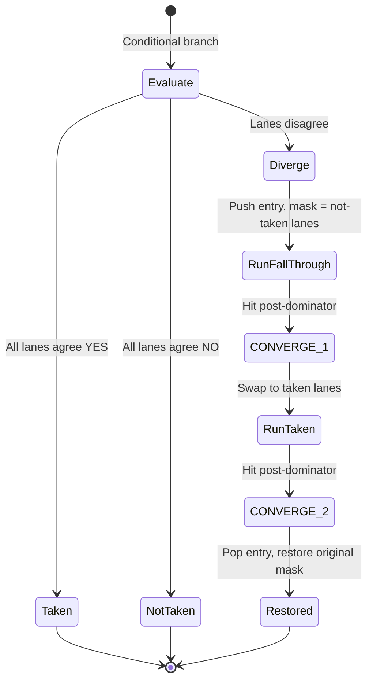

# A Fourth Point in the SIMT Divergence Design Space

A divergence model the industry skipped, from type theory to silicon.

<!-- more -->

## The problem every GPU has to solve

When a GPU hits an `if/else`, some threads want to go left and others want to
go right. This is *divergence*, and it's the fundamental tension in SIMT
(Single Instruction, Multiple Threads) architecture: one program counter,
multiple opinions about what to do next.

The hardware has to run both paths. The question is who decides how.

For thirty years, the industry has explored three points in this design space:

**NVIDIA pre-Volta: hardware IPDOM inference.** The GPU's branch unit
identifies the immediate post-dominator of every branch at runtime, pushes a
mask onto a stack, runs one path, then the other, and pops at the
reconvergence point. The compiler emits straight-line code and the hardware
figures out the rest. Simple compiler, complex silicon. This worked when
NVIDIA had the transistor budget to burn.

**AMD AMDGPU: software structurization.** The compiler rewrites the control
flow graph into a structured form — no irreducible loops, no multi-exit
regions — so the hardware only needs a simple mask stack. Simple hardware,
complex (and notoriously buggy) compiler pass. The structurizer has been a
persistent source of miscompilation bugs in Mesa's AMDGPU backend.

**NVIDIA Volta+: independent thread scheduling.** Each thread gets its own
program counter and the hardware schedules them independently, converging
when it can. Maximally flexible. Maximally complex — both in silicon and in
the programming model, which now has to reason about inter-thread
synchronization explicitly.

Each of these is a forced tradeoff between compiler complexity and hardware
complexity. The design space looks fully explored.

It isn't.

## Auto-diverging branches

Warp-core is a soft GPU I'm building on an ECP5-85F FPGA — 4 independent
SIMT pipelines, 8 lanes each, targeting the ULX3S board. It grew out of
[warp-types](../../research/warp-types.md), a Rust library that
encodes GPU divergence state in the type system. Formalizing what
divergence *means* — which lanes are active, what operations are safe,
how convergence is guaranteed — turned out to be the right preparation
for designing hardware that handles divergence differently.

The ISA went through five iterations in a week (v0.1 through v0.5.2),
and during v0.3 the divergence model landed on a fourth point in the
design space.

The idea: **every conditional branch auto-diverges.** The hardware evaluates
the branch condition on all active lanes simultaneously, then:

1. **All lanes agree (taken):** Normal branch. One cycle. No stack.
2. **All lanes agree (not taken):** Fall through. One cycle. No stack.
3. **Lanes disagree:** Hardware pushes a divergence entry, runs the
   fall-through lanes first, then the taken lanes. CONVERGE at the
   post-dominator pops the entry.

The compiler's only responsibility is inserting CONVERGE at each
post-dominator — a standard analysis (`PostDominatorTree`) that already
exists in LLVM. No structurizer. No runtime IPDOM inference. No independent
thread scheduling.

The hardware cost of the uniformity check? An 8-input AND gate on the lane
predicate vector. On an ECP5, that's a single LUT.



The fast path — uniform branches — has zero overhead. No stack interaction,
no extra cycles. Divergent branches pay for the stack push/pop, but they'd
pay for it under any scheme. The difference is that the compiler doesn't need
to do anything special. It emits branches. The hardware handles divergence.

## The loop problem

There's a catch. Consider a loop where lanes exit gradually:

```c
while (lane_data[lane_id] > threshold) {
    // ... some work ...
    threshold += step;
}
```

On the first iteration, all 8 lanes are active. On the second, maybe 7. Then
5, then 3, then 1. Each iteration, the back-edge branch diverges — some lanes
want to loop again, others want to exit.

Under a naive auto-diverge scheme, every divergent back-edge pushes a new
stack entry. A 1000-iteration loop with gradual exit would push 999 entries.
A 16-deep stack overflows on iteration 17.

The fix is a 12-bit field that costs almost nothing: **source_pc matching.**

Each divergence stack entry records the PC of the branch that created it.
When a divergent branch fires and the top-of-stack `source_pc` matches the
current PC, the hardware recognizes a loop re-entry. Instead of pushing a new
entry, it accumulates the exiting lanes into the existing entry's pending
mask and shrinks the active mask.

```text
Iteration 1:  active = 11111111  → diverges, push entry (source_pc = 0x42)
Iteration 2:  active = 01111111  → source_pc match → update in place
Iteration 3:  active = 00111111  → source_pc match → update in place
...
Iteration N:  active = 00000001  → last lane exits → uniform-taken fires
              CONVERGE at loop exit pops the single entry
```

Any loop, regardless of iteration count, uses exactly one stack entry. The
16-deep stack is for *nesting depth*, not iteration count.

## The divergence stack entry

The entry format reveals the design:

| Field | Bits | Purpose |
|-------|------|---------|
| saved_mask | 8 | Original mask to restore at final pop |
| pending_mask | 8 | Lanes waiting for the other path |
| target_pc | 12 | Where pending lanes start executing |
| source_pc | 12 | PC of the branch (for loop detection) |
| phase | 1 | 0 = first group active, 1 = second group |

41 bits per entry. 16 entries × 4 warps = 2,624 bits total, all in
distributed LUT RAM. No BRAM impact.

The source_pc field is what makes this work. NVIDIA's pre-Volta scheme
doesn't need it (the hardware infers reconvergence). AMD's structurizer
doesn't need it (loops are pre-structured). Independent thread scheduling
doesn't need it (threads have individual PCs). Source_pc is the novel
mechanism — and it's 12 bits of storage per entry.

## CONVERGE: one instruction, two roles

The CONVERGE instruction handles both if/else merge points and loop exits.
Its behavior depends on the phase flag:

**Phase 0, pending target != current PC:** If/else case. Suspend current
lanes. Activate pending lanes at target_pc. Set phase = 1.

**Phase 0, pending target == current PC:** If-without-else optimization. The
"else" group would start exactly here — there's nothing for them to do. Pop
the entry immediately.

**Phase 1:** Both groups have executed. Pop entry, restore saved mask.

**Stack empty:** NOP. The compiler can conservatively insert CONVERGE at
every post-dominator without tracking whether divergence actually occurred.

This last property matters. It means the compiler's CONVERGE insertion is a
pure syntactic transformation — every join point gets a CONVERGE, no
divergence-aware analysis needed. If the branch was uniform, the stack is
empty, CONVERGE is a NOP, one wasted cycle. If it diverged, CONVERGE does
the right thing. The compiler never has to decide.

## What the spec review caught

Three rounds of adversarial spec review — 7 cold agents per round, testing
encoding correctness, budget arithmetic, execution traces, and semantic edge
cases — hardened this design.

The most instructive finding: **DIVERGE with an all-zero predicate.**

If explicit DIVERGE (the manual version, used by hand-written assembly) is
called with a predicate register where all active lanes are zero, the
resulting active mask is 0x00. No lane can execute. No lane can reach
CONVERGE to restore the saved mask. The system deadlocks with no recovery
path.

The fix: the hardware traps. FAULT code 9 (DIVERGE_EMPTY) halts the warp
and records the PC. Auto-diverging branches can't trigger this — if all lanes
agree on "not taken," that's path 2 (uniform, no stack push). The empty-mask
case only arises from explicit DIVERGE, which the compiler never emits.

This is the kind of edge case that survives reading the spec, survives code
review, and only surfaces when an adversarial agent constructs the exact
scenario the designer didn't consider.

## Where this sits

| Approach | Compiler | Hardware | Loop handling |
|----------|----------|----------|---------------|
| NVIDIA pre-Volta | Simple | IPDOM inference | Hardware-managed |
| AMD AMDGPU | Structurizer (complex) | Simple mask stack | Pre-structured |
| NVIDIA Volta+ | Explicit sync | Independent PCs | Per-thread |
| **Warp-core** | **CONVERGE insertion** | **Auto-diverge + source_pc** | **In-place update** |

The compiler cost is one standard analysis (PostDominatorTree). The hardware
cost is a uniformity check (one LUT), wider stack entries (41 bits vs ~12),
and a comparator for source_pc matching. The total cost on ECP5 is a few
hundred LUT4s and zero BRAM.

The benefit is that SIMT divergence — the feature that makes GPU architecture
hard to teach and hard to compile for — becomes almost invisible. Branches
are branches. Loops are loops. The hardware does the bookkeeping. A 1300-line
ISA spec covers the entire mechanism, and a student can read it in an
afternoon.

That's the real point. Warp-core isn't competing with NVIDIA on transistor
count or AMD on compiler sophistication. It exists so someone can hold the
entire divergence model in their head at once — the stack entry format, the
phase flag, the source_pc matching, all of it — and understand exactly what
happens on every branch, in every lane, on every cycle.

Nobody else offers this on a hobbyist FPGA board.

---

🦬☀️ *[warp-core](../../research/warp-core.md) is an open-source soft GPU targeting the ULX3S (ECP5-85F).
ISA v0.5.2 spec is complete; RTL migration is in progress. Not yet public.*
