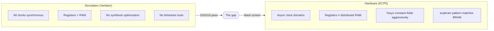

# Debugging by Flashlight

When your diagnostic output shares a data path with the thing that's broken, you're debugging in the dark.

<!-- more -->

## The black screen

Over three hundred simulation tests pass. The ISA is stable at v0.5.2. The signage demo — three lines of centered text on a dark navy background with a vblank-synced accent color breathing effect — is the first program meant to run on actual hardware. The ULX3S board comes up, the HDMI output initializes, and the screen is black.

Expected, honestly. The gap between "all tests pass in Verilator" and "pixels appear on a monitor" is where FPGA projects go to be humbled. What I didn't expect was how long it would take to close that gap, or which bugs would be waiting in it.

A dozen synthesis-program-observe cycles later, I had three independent bugs, a new diagnostic methodology, and a conviction that permanent on-chip instrumentation isn't optional — it's load-bearing infrastructure.

## The diagnostic problem

The first instinct when the screen is black: write diagnostic data to the framebuffer. Binary dots. Register values encoded as colored pixels. The framebuffer is 76,800 pixels of SDRAM-backed memory, and the fill loop that should be painting navy blue is the exact thing that isn't working.

This is the trap. The framebuffer write path goes through an async FIFO — warp clock domain to SDRAM clock domain — and if that FIFO is broken, your diagnostic writes go through the same broken FIFO. You're trying to read a note by the light of the match that's on fire.

Tried mid-frame palette stripes next. Write a known color to the palette register mid-frame to create visible horizontal bands. Failed differently: the warp clock and pixel clock are asynchronous, so the exact scanline where the palette changes is nondeterministic. The stripes jitter between frames, thin enough that a phone camera can't reliably capture them.

The breakthrough was finding a diagnostic output channel that bypasses the broken data plane entirely.

## The flashlight

Palette MMIO writes go directly to BRAM — no async FIFO, no SDRAM, no cross-clock-domain hazard. VBLANK timing is purely in the pixel clock domain. Combining these two facts gives you a diagnostic channel that's completely independent of the framebuffer write path.

The protocol: hold a full-screen color for 20 vblank periods per bit. Blue for separator. White for 1. Black for 0. Record with a phone camera, then decode offline.

Decoding uses the R/B color ratio per frame to distinguish blue separators (R/B < 0.15) from white data bits (R/B > 0.25). Black frames (bit 0) have near-zero absolute intensity, falling outside both thresholds. The R/B ratio is invariant to camera exposure — dim white and bright white both classify correctly, because the ratio cancels out the absolute intensity. Two complete readout cycles decoded identically, cross-validating the method.

This is inelegant. It's also the only diagnostic channel that works when your data plane is down, and it yielded the numbers that cracked the first bug.

## Bug one: Yosys kills your FIFO

The previous debugging session had concluded with a hypothesis: `wr_accept` never fires. The scanline buffer FSM enters `S_WRITE_SETUP` but reads never complete. Something is wrong with the async FIFO between the warp pipelines and SDRAM.

The palette flash readout told a different story. `fb_wr_count`: 11,264. `fb_rd_count`: 11,264. The FIFO drained perfectly. Every entry that made it into the FIFO came out the other side and was written to SDRAM.

The problem was upstream: only 14.7% of writes entered the FIFO in the first place. 11,264 of 76,800. The `fb_ovf` sticky flag confirmed it — the depth-32 FIFO overflows when the warp writes at 20M stores/sec but SDRAM accepts roughly 5M writes/sec. The remaining 65,536 writes were silently dropped.

The fix is backpressure: wire `fb_fifo_full` back through the crossbar to the store unit as a pipeline stall signal. Straightforward. Except `fb_fifo_full` was dead.

This is where it gets instructive.

Yosys performs constant propagation as a standard optimization pass. The framebuffer fill loop dominates execution — it's the vast majority of all stores the program issues. During that loop, bit 19 of the crossbar address (`xbar_addr[19]`) is always 1, because framebuffer addresses all have bit 19 set. Yosys observed this, decided `xbar_addr[19]` is constant, and propagated that constant forward.

The signal `addr_is_mmio` — derived from `xbar_addr[19]` — was folded to FALSE. Every MMIO write, including the mailbox that reports completion, was eliminated. But the same constant propagation reached into the async FIFO module. Signals derived from the address decode — including `wr_valid` and `wr_full` — were optimized away because Yosys concluded they couldn't vary.

Two independent victims of the same optimizer pass on the same async FIFO module.

The first fix attempt had placed `(* keep *)` on `mbox_we_sel`, a downstream consumer. This preserved the wire but not the truth value — the constant had already propagated through the input. The real fix: `(* keep *)` on the source signals. `xbar_addr`, `addr_is_mmio`, `addr_is_fb`, `addr_is_raw` — annotate where the information originates, not where it's consumed.

```verilog
(* keep *) wire [19:0] xbar_addr;
(* keep *) wire        addr_is_mmio;
(* keep *) wire        addr_is_fb;
(* keep *) wire        addr_is_raw;
```

The final form went further: `(* keep *)` on the async FIFO port declarations themselves, protecting all downstream paths at once. One annotation at the module boundary instead of whack-a-mole on individual consumers.

The lesson: `(* keep *)` on a downstream signal doesn't prevent constant-propagation of its inputs. You have to protect the source.

## Bug two: inferred RAM where you expected registers

After the FIFO fix, text rendering hung. The divergence stack — the mechanism that handles SIMT lane divergence on conditional branches — was corrupting its state.

Narrowing the failure mode was the interesting part. `DIVERGE; CONVERGE` with a zero-gap: works. `DIVERGE; STORE; CONVERGE` with a stall gap: works. `DIVERGE; ADDI; CONVERGE` with no stall: hangs. The STORE case worked *because* the drain stall freezes the entire pipeline, masking a timing hazard in the divergence stack.

Root cause: Yosys inferred `TRELLIS_DPR16X4` — an ECP5 async-read distributed RAM primitive — for `div_stack_mask`, the 8-bit lane mask at each nesting level. Distributed RAM on ECP5 has different read timing characteristics than flip-flop registers. In simulation, Verilator models both identically. On hardware, the read data arrives at a different point in the cycle, and the pipeline's combinational logic sees stale values.

Fix: declare `div_stack_mask` as a flat register array with explicit sequential read. No inference ambiguity. The synthesizer can't choose the wrong primitive if you don't give it a choice.

This bug was invisible in simulation because Verilator doesn't model the distinction between register files and distributed RAM. Every read returns the most recently written value on the same cycle. On the ECP5, that's only true for registers.

## Bug three: ecpbram's pattern-matching assumption

This one is subtle enough to deserve its own section.

`ecpbram` is the fast-reprogramming tool — it patches BRAM contents in a bitstream without re-running place-and-route, turning a 15-minute synthesis cycle into a 3-second patch. It works by decomposing each BRAM into 32 independent bit-slices, searching the bitstream for each slice's pattern, and replacing it.

The instruction memory was padded with a fixed bit pattern beyond the program. This put 16 of the 32 bit-slices at all-ones for 340 consecutive entries. The all-ones pattern matched other BRAMs in the design — not just the instruction memory. `ecpbram` patched the wrong memory.

Fix: replace the `0xFFFF` padding with a Knuth multiplicative hash of the address. Each padding word is unique, spreading bits across all 32 slices with roughly 50% density per slice. No spurious matches.

```python
# Before: padding with a fixed prefix that creates all-ones bit-slices
for addr in range(program_end, mem_size):
    mem[addr] = 0xFFFF0000 | addr

# After: Knuth hash spreads bits across all 32 slices
for addr in range(program_end, mem_size):
    mem[addr] = ((addr + 1) * 0x9E3779B1) & 0xFFFFFFFF
```

This bug class is invisible to simulation because `ecpbram` isn't part of the simulation flow. It only manifests when you reprogram the bitstream — a step that doesn't exist in the Verilator workflow.

## The simulation gap



All three bugs live in the space between "behaviorally correct" and "synthesizes correctly." Simulation doesn't model clock domain crossings realistically. Simulation doesn't distinguish between register files and inferred RAM primitives. Simulation doesn't run the bitstream patching tool. Three separate classes of bug, none of which can be caught by writing better testbenches in the conventional sense.

This isn't a criticism of Verilator — it's doing exactly what it's designed to do, which is behavioral simulation. The problem is treating behavioral correctness as a proxy for hardware correctness. It's a necessary condition, not a sufficient one.

## Permanent instrumentation

The fix isn't better simulation. The fix is building the diagnostic infrastructure into the design permanently, not bolting it on when something breaks.

Warp-core now ships a 13-register diagnostic MMIO block at addresses `0xA0` through `0xAF`:

| Register | Content |
|----------|---------|
| `0xA0-0xA3` | FB FIFO write/read counters (16-bit, split across byte pairs) |
| `0xA4` | FB + Raw FIFO status (overflow, full, empty) |
| `0xA5` | scanline_buf FSM state + sticky flags (wr_seen_idle, preempted, wr_seen_fetch, reached_req) |
| `0xA6-0xA9` | Raw FIFO write/read counters (16-bit, split across byte pairs) |
| `0xAA` | Snapshot trigger (toggle-based CDC) |
| `0xAB` | Clear-all (resets both clock domains) |
| `0xAC` | Snapshot valid flag |

These registers cost roughly 80-100 LUTs on a chip with ~84K — and they're always present. When the next hardware bug surfaces, the first program I load won't be the signage demo. It'll be a ten-line diagnostic that reads `0xA0` through `0xAF` and flashes them out through the palette channel.

The palette flash readout is the flashlight you keep in the drawer. The diagnostic MMIO block is the wiring that makes the flashlight worth holding. Together, they give you ground truth about what the hardware is actually doing, independent of the data plane, independent of simulation assumptions, independent of synthesis optimizations you didn't know were happening.

## Make intent explicit

The common thread across all three bugs: the designer's intent was ambiguous, and the tools resolved the ambiguity differently than expected.

Yosys saw a signal that happened to be constant during the dominant execution path and folded it. Intent: this signal varies at runtime. Fix: `(* keep *)` at the source.

Yosys saw a small indexed array and inferred distributed RAM. Intent: these are pipeline registers with same-cycle read. Fix: flat register declaration.

`ecpbram` saw a bit-pattern that matched multiple BRAMs. Intent: this pattern uniquely identifies the instruction memory. Fix: hash-spread padding with no repeated slices.

In each case, the fix makes the intent explicit in a form the toolchain can't misinterpret. Not "I hope the synthesizer does the right thing." Not "simulation says this works." Explicit structural declarations that leave no room for reinterpretation.

This is the real argument. Simulation tells you whether your logic is correct. Synthesis decides how to implement it. The gap between those two — where correct logic becomes incorrect hardware — is closed by making every structural intent unambiguous. Annotate the clock domain boundaries. Declare your register files as registers. Ensure your memory contents are unique. Build the counters that let you verify, on hardware, that synthesis did what you meant.

The screen isn't black anymore.

---

🦬☀️ *warp-core is a 4-pipeline SIMT soft GPU on ECP5-85F. [GitHub](https://github.com/modelmiser/warp-core).*
