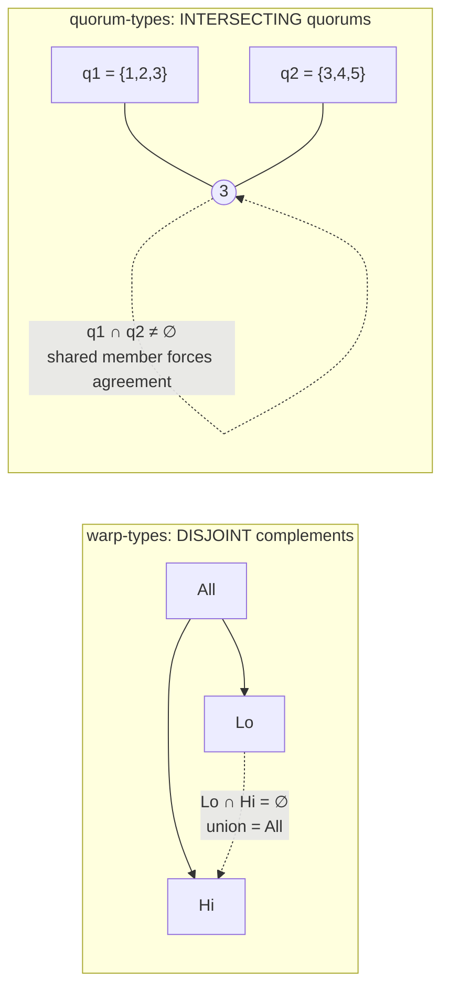

# Disjoint Becomes Intersecting

Generalizing a partition-based type system to a failure-tolerant one is not making the set bigger — it is flipping which set relation the type guards.

<!-- more -->

## Where this picks up

[warp-types](https://github.com/modelmiser/warp-types) makes GPU warp divergence safe at the type level: a diverged warp cannot call a shuffle because the method does not exist on its type — the argument for that is in [What the Type Erases To](what-the-type-erases-to.md). quorum-types asks whether that discipline survives the move from a warp to a distributed system, and [Split-Brain, Unrepresentable](split-brain-unrepresentable.md) took the first step: lift the configuration epoch into a type parameter so a `merge` of two halves from different epochs fails to unify `E` and becomes a compile error. That post ended on an honest limit — the epoch is necessary but not sufficient, because split-brain is *temporal* and no type can say "wait for the old lease to expire." This post is about a different limit, and a more surprising one.

The base type system models a warp faithfully: a full membership `All` splits into two complementary halves `Lo` and `Hi`, and `merge` recombines them only when the compiler can prove they are complements (`Lo: ComplementOf<Hi>`). That is a partition. `Lo ∩ Hi = ∅` and `Lo ∪ Hi = All`, the two facts a warp's lanes satisfy by construction. The obvious next question — how do you go from at-most-two static halves to a cluster of unbounded size that loses members? — sounds like a scaling problem. Make the type-level set machinery carry arbitrarily many parts instead of two. That framing is wrong, and the way it is wrong is the whole point.

## Why a warp gets to partition

The reason `ComplementOf` is safe in warp-types is a fact about GPUs that never appears in the type: a warp never fails. All 32 lanes are physically present on every cycle. When execution diverges, the inactive lanes still exist — their registers hold values, they are just not on the current control path — and when the two halves merge back, every lane is accounted for. The partition is total because nothing can go missing. `Lo` and `Hi` between them *are* the whole, always.

A distributed cluster is the exact opposite. Failure tolerance means the system must make progress *without* some of its members — that is the entire reason to have more than one node. A group that required all `n` members to agree would be less available than a single machine, because any one crash would halt it. So consensus is built on quorums: subsets large enough to act on behalf of the whole while some members are down or unreachable. The moment you admit "act without all members," the partition guarantee is gone. Two quorums formed at different moments need not be complementary, need not union to the whole, and — here is the danger — need not be disjoint or overlapping by any structural law. Whether they overlap is now a property you have to *arrange*, not one the hardware hands you.

## The flip

Arrange it the right way and safety comes back, but through the opposite relation. In the warp, the safety-carrying fact was disjointness: the halves are complements, so they cover the whole exactly once. In the cluster, the safety-carrying fact is *intersection*: any two quorums must share at least one member. That shared member is what forces agreement. If two would-be leaders each assemble a quorum, and every possible pair of quorums overlaps, then some node belongs to both — and a node that has already voted for one leader can refuse the other. Overlap is the mechanism by which "act without all members" stops short of "two disjoint groups both commit." Disjoint was the invariant that made the warp safe; disjoint is precisely what must be forbidden here.



This is not a new idea in distributed systems — it is the classical quorum-intersection property, the thing Gifford's 1979 weighted-voting scheme and every majority-quorum system since is built on. quorum-types does not discover it. What is worth writing down is the *direction of arrival*: starting from a type system whose safety rests on disjoint complements and asking "what has to change for failure," the answer that falls out is "invert the set relation," and the inverted relation is exactly the established one. When a generalization reproduces textbook wisdom from a different starting point, that is evidence the model is tracking something real rather than inventing a shape that only looks right.

## The arithmetic that makes it free

Intersection is not asserted; it is forced by the threshold, and the argument is pure counting. Take a majority quorum: strictly more than half the members, `⌊n/2⌋ + 1`. Two subsets each of that size have sizes summing to at least `2(⌊n/2⌋ + 1)`. For odd `n` that is `n + 1`; for even `n` it is `n + 2`. Either way, at least `n + 1`. But there are only `n` members. By inclusion–exclusion, `|q1| + |q2| = |q1 ∪ q2| + |q1 ∩ q2| ≤ n + |q1 ∩ q2|`, so `|q1 ∩ q2| ≥ (n + 1) − n = 1`. Two sets that each hold a majority cannot fit inside the cluster without colliding on at least one member. Pigeonhole. The threshold `⌊n/2⌋ + 1` is chosen precisely so this collision is unavoidable.

Because the guarantee is arithmetic over small sets rather than a deep proof, the honest way to check the *encoding* is to enumerate. The property test builds every configuration of size `n ∈ 1..=6`, enumerates all `2ⁿ` subsets by bitmask, keeps the ones that certify as quorums, and asserts that every pair of them shares a member. It is exhaustive over that domain — not a proof for all `n`, but stronger evidence that the code implements the relation than a hand-waved sketch would be. This is a feasibility toy and the bound is real: `n ≤ 6`. The claim is "holds in the checked domain," not "proven in general."

## Keeping the type relational

Here is the encoding question the flip forces. A quorum can be any majority subset of an unbounded set — how do you put *that* in a type without the type growing without bound? The answer is that you do not put the members in the type at all. The type carries the *relation*, not the *elements*.

```rust
/// A configuration at type-level epoch `E`: a runtime set of any size.
pub struct Config<const E: u64> {
    members: BTreeSet<NodeId>,
}

/// A *certified* majority subset of a `Config` at epoch `E`.
#[must_use = "a Quorum is a certified majority; use it or the certification was pointless"]
pub struct Quorum<const E: u64> {
    members: BTreeSet<NodeId>,
}

impl<const E: u64> Config<E> {
    /// Strictly more than half: ⌊n/2⌋ + 1.
    pub fn threshold(&self) -> usize {
        self.members.len() / 2 + 1
    }

    /// The `gradual` boundary: certify a runtime subset as a Quorum.
    /// `None` unless `subset` is drawn from this config and reaches majority.
    pub fn certify(&self, subset: BTreeSet<NodeId>) -> Option<Quorum<E>> {
        if subset.is_subset(&self.members) && subset.len() >= self.threshold() {
            Some(Quorum { members: subset })
        } else {
            None
        }
    }
}

impl<const E: u64> Quorum<E> {
    /// The relational safety lemma: a member shared with `other`.
    /// Same-config quorums always overlap; the shared `E` is enforced by the type.
    pub fn intersect(&self, other: &Quorum<E>) -> Option<NodeId> {
        self.members.intersection(&other.members).next().copied()
    }
}
```

`Config<E>` holds a `BTreeSet<NodeId>` of any size — the membership is a runtime value, unbounded, exactly where an extensional set belongs. What the type knows is one bit of *relational* fact: the epoch `E`, the generation this configuration belongs to. `Quorum<E>` adds one more: possessing this token is evidence its members form a majority of configuration `E`. Which members? The type does not say and does not care. That is what buys the unboundedness. An extensional type — one that enumerated the members — would have to grow with the cluster. A relational type carries a fixed, small guarantee ("is a majority of `E`") regardless of how many nodes `E` has.

The `certify` method is the seam. It is a runtime-checked boundary: it looks at the actual subset, confirms it is drawn from the configuration and reaches the threshold, and only then mints a `Quorum<E>`. Its `Option` return *is* the certificate — `None` means "no proof, no token." This is the gradual-typing pattern warp-types uses at its `DynWarp` boundary, in the same shape: check once at the edge, then trust structurally on the inside. After `certify` succeeds, `intersect` never re-examines the threshold. It takes a `Quorum<E>` and another `Quorum<E>` and returns a shared member, and the signature alone guarantees that member exists, because two majorities of the same configuration always overlap. The runtime check happens exactly once, at the boundary; everything inside trades on the type.

## The epoch guard rides along

The compile-time layer from the previous post does not go away — it composes. `intersect` takes two `Quorum<E>` at the *same* `E`. Quorums of different configurations have different epochs, so you cannot even *ask* whether a `Quorum<0>` and a `Quorum<1>` overlap:

```rust
let q0 = Config::<0>::new(BTreeSet::from([1, 2, 3])).certify(/* ... */).unwrap();
let q1 = Config::<1>::new(BTreeSet::from([1, 2, 3])).certify(/* ... */).unwrap();
let _ = q0.intersect(&q1); // compile error: expected `0`, found `1`
```

That rejection matters because the intersection *lemma is false across epochs*. Reconfigure a cluster from `{1,2,3}` to `{4,5,6}` and a majority of the old and a majority of the new can be completely disjoint — the arithmetic that forced overlap assumed a single membership of size `n`, and across a reconfiguration there is no single `n`. So cross-epoch intersection is not merely unproven, it is wrong, and the type refuses to express it. The epoch guard is the compiler declining to apply a same-configuration lemma to a cross-configuration question. Which safety covers the cross-epoch gap — a leader lease, or joint majorities spanning both configs — is a separate mechanism and a separate story; the relevant fact here is that the type will not let you mistake one regime for the other.

## What this is and isn't

The membership is a `BTreeSet<NodeId>`, the property test stops at `n = 6`, and there is no wire protocol, no message loss, no Byzantine tolerance behind any of this. Overlap is *necessary* for agreement but not alone *sufficient* — the shared member still has to refuse to double-vote, and this toy does not model the voting, only the set relation that makes a correct vote possible. quorum-types is a feasibility study, and its result is narrow and specific: the mechanism that made a partition-based type system safe generalizes to a failure-tolerant one not by scaling the set up, but by inverting the relation the type guards, and the inversion lands on the classical majority-quorum property. Disjoint complements were safe because a warp never fails. Intersecting quorums are safe because a cluster does. Same discipline — the type carries the relation, the runtime carries the elements, one certified boundary between them — pointed at the opposite invariant.

---

🦬☀️ *quorum-types is a feasibility study — a distributed-systems generalization of warp-types. [GitHub](https://github.com/modelmiser/quorum-types).*
