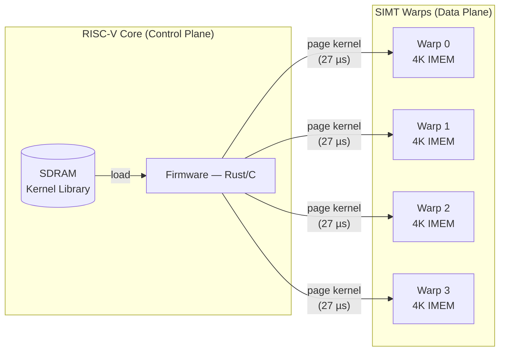

# Every Constraint Was a Door

The hardware limits that killed the original roadmap turned out to unlock a better one.

<!-- more -->

## The plan that couldn't fit

Warp-core is a soft GPU on a Lattice ECP5-85F FPGA — four SIMT pipelines, eight
lanes each, running on a ULX3S board. The original architecture dedicated three
warps to user compute and reserved the fourth as a supervisor: shell, scheduler,
lifecycle management, all running as hand-written SIMT assembly.

The roadmap said: target the warps with Rust via an LLVM backend. Real types,
real tooling, real libraries — the whole Rust ecosystem available on custom
silicon. It was a compelling vision.

It died on a number: 4096 words of instruction memory per warp.

Rust's monomorphization strategy generates specialized code for every concrete
type. A generic function over two types produces two copies. Panic machinery,
formatting infrastructure, and trait dispatch all emit instructions whether you
use them or not. Fifty lines of Rust routinely expand to 500-1000 instructions
after optimization. At that ratio, 4K IMEM holds maybe four to eight
non-trivial functions. A shell, a scheduler, and a lifecycle manager? Not a
chance.

The instinct was to fight the constraint. Larger IMEM? The ECP5-85F has 3744
Kbit of BRAM total, and the four warps, register files, divergence stacks, and
SDRAM controller already claim most of it. Instruction streaming from SDRAM?
That requires a cache hierarchy, and a cache hierarchy destroys the deterministic
per-instruction cycle costs that make SIMT analysis tractable.

The constraint wasn't going to move. The question was whether accepting it would
leave anything worth building.

It left a better architecture than the one it killed.

## The RISC-V pivot

If warp 3 can't run Rust because 4K IMEM is too small for a compiled systems
language, the structural answer is: don't run Rust on a warp. Run it on
something designed for compiled systems languages.

Replace warp 3 — the supervisor tile — with a small RISC-V core. VexRiscv
RV32IMC, five-stage pipeline, 16 KB instruction tightly-coupled memory, 8 KB
data TCM, running at 150 MHz in its own clock domain with a CDC bridge to the
warp fabric. A real CPU, with real caches, real linking, and a real C/Rust
toolchain.

The resource comparison is illuminating. A single SIMT tile costs approximately
8K LUTs, 14 BRAM blocks, and 8 DSP slices. The full RISC-V subsystem — core,
TCMs, CDC bridge — costs roughly 2.9K LUTs, 16 BRAM, and 1 DSP. The RISC-V
is additional hardware (all four SIMT tiles remain), but it costs less than a
third of what a fifth tile would. The control plane is cheap. The supervisor
warp was the most expensive way to run control logic the architecture offered,
and nobody noticed until 4K IMEM forced the question.

## What fell out

The RISC-V pivot didn't solve one problem. It triggered a cascade where each
consequence opened the next door.

**All four warps become user-assignable.** The supervisor consumed 25% of the
SIMT compute for housekeeping. With a RISC-V core handling control, all four
warps run user kernels. The theoretical peak throughput increased by a third.

**The programming model split into its natural domains.** Rust on the RISC-V
core handles the control plane — shell interaction, kernel loading, lifecycle
management, anything that benefits from a real type system and unbounded code
size. A structured DSL on the warps handles the data plane — short, predictable,
deterministic compute kernels.

This is the division of labor that made GPUs successful. You don't write
applications in GPU shaders. You write applications in C++ or Rust, and you
dispatch kernels. NVIDIA didn't arrive at the CUDA model by theory — they
arrived at it because shader processors have small local memory and fixed
pipelines, and a host CPU has neither constraint. Warp-core arrived at the same
split from first principles on a hobbyist FPGA, because the constraints are
structurally identical.

**Kernel reload became nearly free.** The RISC-V core has a direct write port
into each warp's BRAM. Loading a new kernel — writing 4096 words at 150 MHz
— takes approximately 27 microseconds. Compare that to SPI flash reload
at around 1.6 milliseconds. That's 60x faster.

At 27 microseconds, 4K IMEM stops being a constraint on program size entirely.
It becomes a window. The RISC-V firmware pages kernels from SDRAM, loads them
into warp IMEM, dispatches, waits for completion, loads the next. The effective
instruction memory is as large as SDRAM — gigabytes if you want it — with a
swap cost so low that chaining dozens of small kernels is cheaper than running
one large one with complex control flow.

SDRAM instruction streaming would have required a cache hierarchy that destroys
the deterministic performance model. Kernel chaining preserves it completely:
each kernel's cycle count is statically known, each reload is a fixed cost, and
the total is their sum.

## The DSL that 4K IMEM demanded

With Rust running on the RISC-V core and warps reduced to kernel execution,
the warp instruction set needed a different kind of language. Not a systems
language — the warps don't allocate, don't recurse, and don't link. A domain
language that maps 1:1 to the hardware.

The warp DSL has named variables (mapped to registers by the assembler),
structured control flow (if/while with automatic CONVERGE insertion), and
arithmetic operations that correspond directly to individual instructions.
No heap. No recursion. No indirect jumps. No function calls beyond inline
expansion. Every operation has a known cycle cost. Every kernel terminates
in bounded time.

If this sounds like CUDA C without the C runtime, that's roughly what it is
— a notation for expressing parallel compute kernels where the programmer
thinks in terms of lanes and the hardware handles divergence. The difference
is that on warp-core, the DSL is the native language, not a subset of C++
with a proprietary compiler.

The constraints that killed Rust on warps — small memory, no dynamic allocation,
no complex control flow — are precisely the constraints that make the DSL
tractable. They aren't limitations the language works around. They're properties
the language exploits.

## The verification door

Here's where the cascade reaches territory the original roadmap couldn't have
accessed.

Formal verification of GPU kernels is hard. CUDA C supports features —
device-side `malloc`, recursion since CUDA 3.1, complex control flow — that
make proving termination, let alone correctness, a heavyweight effort.
Academic tools like GPUVerify and VerCors have made progress on specific
properties (race freedom, barrier safety), but formal verification of
general CUDA kernels remains a research topic, not standard practice.

The warp DSL's constraints eliminate every source of that difficulty:

**No heap, no aliasing analysis.** Every value lives in a register or a fixed
SDRAM address. The verifier doesn't need to reason about pointer provenance
because there are no pointers.

**No recursion, bounded loops.** Every loop has a cycle budget annotation. The
DSL compiler rejects kernels that can't prove termination within the budget.
Termination is a syntactic property, not a semantic one.

**No indirect jumps, fixed control flow graph.** The CFG is known at compile
time and doesn't depend on input data. Divergence analysis is exact.

**Deterministic SIMT divergence.** The [auto-diverging branch
model](../../04/a-fourth-point-in-the-simt-divergence-design-space/)
means divergence stack depth is bounded by nesting depth, not iteration count.
The verifier can statically bound the maximum stack depth for any kernel.

**Known per-instruction cycle costs.** At the system clock, every instruction
takes a fixed number of cycles. A kernel's worst-case execution time is the
sum of its instruction costs along the longest path through the CFG. No cache
misses, no branch mispredictions, no memory latency variation.

These properties compose. If each kernel terminates within its budget, a chain
of kernels terminates within the sum of budgets. If each kernel accesses SDRAM
within declared bounds, the composition has non-overlapping memory regions by
construction. Whole-system verification reduces to per-kernel verification plus
a composition check — and each kernel is short enough (4K instructions maximum)
that exhaustive analysis is tractable.

The verification targets become concrete and checkable:

- **Termination:** provable from cycle budgets and bounded loops
- **Memory safety:** provable from declared SDRAM regions
- **Divergence safety:** provable from nesting depth analysis
- **Budget compliance:** provable from instruction-level cycle costs
- **Composition:** non-overlapping SDRAM regions, total budget within frame

This is where the 4K IMEM limit reveals its deepest consequence. Rust on warps
would have produced kernels that are Turing-complete in practice — heap
allocation, recursion, dynamic dispatch. Verifying those requires solving the
halting problem in all but name. The DSL produces kernels that are
intentionally sub-Turing — and that's exactly the class of programs where
formal verification is decidable.

What killed Rust on warps enabled Sol verification. The constraint was a door
to a room that doesn't exist on the other side.

## The clock speed question

None of this matters if the warps can't do useful work. At 20 MHz — the initial
clock rate — SIMT only wins over scalar execution for workloads with memory
coalescing, like display rendering where eight adjacent lanes read eight adjacent
pixels. For general compute, the overhead of SIMT dispatch at 20 MHz makes
scalar code on the RISC-V core faster.

The crossover is around 50 MHz, where the SIMT parallelism consistently
outweighs the dispatch overhead. Getting there on an ECP5 requires pipelining
— breaking combinational paths that the synthesis tool can't close at higher
frequencies.

The jump from 25.5 MHz (2-stage pipeline, seed-dependent) to 36–38.5 MHz
(3-stage pipeline, narrow spread across seeds) was existential, not optional. Below
the crossover frequency, warp-core is a teaching tool. Above it, the SIMT
warps earn their silicon. Three-stage pipelining — splitting decode, execute,
and writeback into distinct clock-edge boundaries — was the minimum viable
pipeline depth to reach the crossover zone on ECP5 fabric.

36–38.5 MHz is not 50 MHz. The gap matters. But it's close enough that
memory-coalesced workloads (the primary use case — display, particle systems,
signal processing) are firmly in the SIMT-wins regime. General-purpose
compute kernels still need careful attention to keep the SIMT advantage
positive.

## MIPS learned this the hard way

The pattern — accepting a constraint instead of fighting it, and discovering
the constraint was guarding a better design — has a well-known counterexample.
MIPS exposed its pipeline bubble as a "feature": the branch delay slot. The
instruction after a branch always executes, regardless of whether the branch
is taken. The compiler fills it with useful work. It was a clever encoding of
a 2-stage pipeline artifact into the ISA.

It was also a mistake that haunted MIPS for decades. Every subsequent pipeline
revision — superscalar, out-of-order, deeper pipelines — had to honor the
delay slot contract. The constraint became permanent architecture, not a door
to better design. RISC-V and ARM both chose to squash the wasted cycle instead,
paying one dead fetch but preserving pipeline freedom. In warp-core's 2-stage
pipeline, the squash costs zero LUTs — a single flip-flop gates writeback for
exactly one cycle.

The difference: MIPS treated the pipeline bubble as a surface to optimize.
Warp-core treated the 4K IMEM limit as a signal about where different kinds
of code belong. One constraint was absorbed into the architecture's semantics,
making it permanent. The other was absorbed into the architecture's *topology*,
revealing a natural partition.

## Three languages, three domains

The final architecture has three native languages, each matched to its domain:

**Verilog** defines the hardware — pipeline stages, memory interfaces, clock
domain crossings. This is the substrate layer, frozen at synthesis time.

**Rust** (or C) on the RISC-V core handles the control plane — kernel loading,
shell interaction, device management. Unlimited code size, real linking, real
libraries. Firmware engineers write here without learning SIMT.

**Warp DSL** on the SIMT pipelines handles the data plane — short, verifiable,
deterministic compute kernels. Specialists write here, thinking in lanes and
masks and cycle budgets.

The boundaries between these three languages are the architecture's load-bearing
joints. Verilog defines what the hardware can do. Rust decides what it should
do. The DSL does it, in bounded time, with formal guarantees. No language
crosses into another's domain, because crossing would sacrifice the properties
that make each domain tractable.

This three-language split wasn't designed. It was forced by a 4096-word
instruction memory, a 2.9K-LUT RISC-V core at 150 MHz, and the observation that
deterministic kernels are verifiable kernels. Every constraint, when accepted
instead of fought, revealed a design that was invisible from the other
side.

The original roadmap — Rust on everything — would have produced a system that
was uniformly complex. The constrained roadmap produced a system that is
simple where it can be and powerful where it must be. The 4K IMEM limit
didn't shrink the design space. It partitioned it into regions where different
tools could each do their best work.

Constraints aren't walls. They're walls with doors in them. But the doors
are only visible from the constrained side.

---

🦬☀️ *[warp-core](../../research/warp-core.md) is an open-source soft GPU on ECP5-85F FPGA.
[GitHub](https://github.com/modelmiser/warp-core).*
