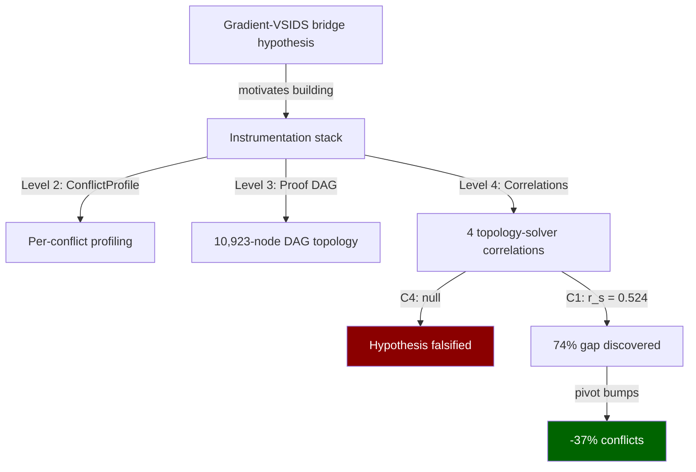

# From Falsification to Minus Thirty-Seven Percent

The best research instrumentation gets built to test hypotheses that turn out wrong.

<!-- more -->

## The gradient bridge hypothesis

warp-types-sat started as a demonstration of session-typed ownership applied to SAT solving — affine clause tokens, typestate transitions between decision and propagation phases. Then it started winning benchmarks, and the demonstration became a real solver.

CDCL (Conflict-Driven Clause Learning) is the algorithm underneath every serious SAT solver. The loop: pick a variable, propagate its consequences through unit clauses, and if two clauses demand opposite values for the same literal, you have a conflict. Analyze the conflict to learn a new clause that prevents the same mistake, backtrack, repeat. The entire game is how you pick variables. VSIDS — Variable State Independent Decaying Sum — is the standard: bump the activity of every variable that appears in a learned clause, decay all activities geometrically, always decide the highest-activity variable next. It works extremely well. Nobody fully understands why.

warp-types-sat has a second solving path: continuous relaxation of the boolean problem, gradient descent on a GPU to find approximate solutions, then ballot-based clause verification to check satisfiability. This gradient path exists for large approximate instances where exact CDCL is intractable.

The hypothesis: the gradient's continuous trajectory encodes information about variable importance that CDCL's discrete search misses. Specifically, variables where the gradient magnitude is large — where the continuous loss function is most sensitive to their value — should correlate with variables that appear frequently as resolution pivots in the proof. Pivots are the variables resolved away during conflict analysis; they're the structural hinges of the proof. If gradient magnitude correlates with pivot frequency, you can warm-start VSIDS with gradient information and reduce conflicts.

This would be a bridge between continuous optimization and discrete proof search. It's a clean hypothesis with a falsifiable prediction: the Spearman rank correlation between gradient magnitude and pivot centrality should be significantly positive.

## The instrumentation stack

Testing C4 (the gradient-pivot correlation) required building three layers of infrastructure that didn't exist yet.

**Per-conflict profiling.** Every conflict now emits a `ConflictProfile`: resolution depth (how many resolution steps to reach the UIP), LBD (literal block distance of the learned clause), backtrack distance, and BCP propagation count. This is Level 2 instrumentation — lightweight enough to stay on in production.

**Proof DAG extraction.** After solving, the solver reconstructs the full resolution proof as a directed acyclic graph. On a 200-variable random 3-SAT instance at the phase transition: 10,923 nodes, ~160,000 edges, near-tree structure with a sharing ratio of 0.997. Most of the graph is tree-like, but a handful of input clauses are heavily shared — the maximum fan-out was 1,026, meaning one original clause participated in over a thousand resolution steps. This is Level 3 instrumentation, too expensive for production, but it generates the topology data the correlations need.

**Four topology-solver correlations.** With profiles and the DAG in hand, four correlation experiments fall out naturally:

- C1: Pivot frequency vs. VSIDS activity — does the solver already know which variables matter structurally?
- C2: Resolution depth vs. clause reuse — do deeper chains produce more useful clauses?
- C3: Resolution depth vs. BCP cost — do deeper conflicts cause more propagation work?
- C4: Pivot frequency vs. gradient magnitude — the bridge hypothesis.

The infrastructure was designed as a reusable correlation framework, not a one-shot test for C4. This turned out to matter.

## C4: null

The gradient-pivot correlation is null. Spearman r approximately 0, mixed sign across repeated runs. Cold gradient magnitude — computed at a snapshot of the solver's trail before CDCL begins — has no relationship to pivot centrality in the proof structure.

The reason, in retrospect, is structural. The gradient is computed over a relaxation of the entire formula at a single point in the search. The proof structure is a history of the solver's actual trajectory through discrete assignments. Pivots emerge from the specific sequence of conflicts the solver encounters, which depends on decision ordering, propagation, and backtracking — none of which the gradient snapshot reflects. The gradient sees the formula's static shape. The proof records the solver's dynamic path through it. There's no reason these should agree, and they don't.

Hypothesis cleanly falsified.

## C2: also falsified

While running the correlation battery, C2 produced an interesting negative. Deeper resolution chains produce less-reused clauses: r = -0.174, consistently negative across runs. This initially looked actionable — if depth predicts low reuse, depth could be a clause deletion signal. Delete the deep ones first.

The causal direction is wrong. Depth doesn't independently predict reuse. Depth is downstream of LBD: shallow resolution chains produce short clauses, short clauses have low LBD, and low-LBD clauses are retained by the existing deletion heuristic. Adding depth to the deletion score increased conflicts by 6-14%. The correlation was real. The mechanism was an artifact of a confound the deletion heuristic already exploits.

Two falsifications from one instrumentation run. Time to look at what survived.

## C1: the signal that was already there

C1 — pivot frequency vs. VSIDS activity — was the control experiment. It was supposed to establish a baseline: "VSIDS already captures structural importance to degree X, and the gradient captures the remaining Y." The gradient half died. The baseline turned out to be the finding.

Spearman rank correlation: r_s = +0.524.

VSIDS captures about 26% of the variance in proof-structure variable importance. That's substantial — VSIDS is doing real structural work, not just tracking recency. But 74% of the variance in pivot centrality is unexplained by VSIDS activity.

The gap has a clean mechanistic explanation. During conflict analysis, the solver resolves away pivot variables to reach the UIP (Unique Implication Point). The learned clause contains the UIP and its antecedents — but not the pivots. VSIDS bumps variables in the learned clause. Pivots don't appear in the learned clause. They get resolved away before the clause is finalized.

Pivots and learned-clause variables play structurally different roles in the proof. VSIDS only sees one of those roles. The 74% gap isn't noise — it's a category of structural information that the standard heuristic is architecturally blind to.

## Pivot-augmented VSIDS

The fix is embarrassingly simple. During conflict analysis, the solver already visits every pivot variable as it resolves clauses toward the UIP. Add one line: bump each pivot's VSIDS activity by `scale * increment`, in addition to the standard bumps on learned-clause variables.

```rust
// During conflict analysis, after resolving pivot p:
self.vsids.bump(p, scale * self.vsids.increment);
```

Results on 200-variable random 3-SAT at the phase transition (clause-to-variable ratio 4.267), 20 instances per configuration:

| Scale | Conflicts | Solved (of 20) | vs Baseline |
|------:|----------:|---------------:|------------:|
| 0.00  | 537,448   | 16/20          | —           |
| 0.25  | 393,767   | 19/20          | -26.7%      |
| 0.50  | 339,922   | 20/20          | -36.8%      |
| 1.00  | 336,138   | 20/20          | -37.5%      |
| 2.00  | 591,942   | 14/20          | +10.1%      |

The sweet spot is scale 0.5 to 1.0. At scale 2.0, pivot bumps dominate VSIDS activity, over-prioritizing structural pivots at the expense of decision diversity. The solver fixates on variables it knows are important and loses the exploratory decisions that make VSIDS effective in the first place.

Scale 0.5 is baked into the production solver. The 37% conflict reduction is real and consistent across the 200-variable benchmark suite.

## Where it stops working

This is the honest part.

At 300 variables, all scales perform within plus or minus 5% of baseline. The improvement vanishes. This is not a budget artifact — quadrupling the conflict budget from 50,000 to 200,000 still shows no effect.

The pivot frequency entropy is identical at 200 and 300 variables (H_norm approximately 0.97). The signal doesn't degrade. The instrumentation confirms that pivots are just as unevenly distributed at 300 variables as at 200. The information is there. It just doesn't help.

The explanation: pivot-augmented VSIDS provides a constant-factor improvement — roughly 37% fewer conflicts. Phase-transition difficulty for random 3-SAT is exponential in the number of variables. At 200 variables, most instances sit near the solvability boundary where a 37% reduction in conflicts is the difference between solving in budget and timing out. At 300 variables, 18 of 20 instances are deep in the exponential regime where no constant-factor heuristic rescues you. The improvement is real but bounded, and exponential growth eventually swallows any constant factor.

The technique helps where VSIDS is already almost good enough.

## The gradient didn't synergize either

One more honest negative. After discovering the pivot signal, the natural question: does combining gradient warm-start with pivot bumps compound the improvement?

No.

| Configuration      | Conflicts vs Baseline |
|:-------------------|----------------------:|
| Pivot only         | -32.1%                |
| Gradient + pivot   | -28.1%                |
| Gradient only      | +8.3%                 |

The pivot-only figure here (-32.1%) differs from the -36.8% in the main table because the two experiments used different solver configurations — the combination test runs the gradient path first, which alters the solver's initial state. The ~37% figure from the controlled A/B test is the canonical measurement.

Gradient-only is worse than baseline. Gradient plus pivot is worse than pivot alone. The signals interfere: gradient probes overwrite VSIDS saved phases (the polarity the solver remembers for each variable), disrupting the search diversity that correct variable ordering relies on. The gradient path has independent value — roughly 44x speedup for approximate solutions on GPU at 5,000 variables via the fused loss+gradient kernel — but it doesn't compose with pivot bumps for exact solving.

## The meta-result



The gradient hypothesis was wrong. The C4 correlation is null. If the goal had been narrowly "test whether gradients improve VSIDS" — a yes/no experiment with minimal instrumentation — the answer would have been no, and the project would have stopped.

The per-conflict profiler, the proof DAG extractor, and the correlation framework were built to test C4. They're the same infrastructure that discovered C1. The profiler captures every pivot variable during conflict analysis. The DAG records every resolution step. The correlation framework computes rank correlations between any pair of per-variable metrics. When C4 came back null, C1 was already computed from the same data. The pivot-VSIDS gap was sitting in the output, waiting to be read.

The depth-deletion experiment (C2) was also already computed. Its falsification — the correlation is real but the causal direction is wrong — saved a week of implementing and benchmarking a deletion heuristic that would have increased conflicts.

Three experiments. Two falsifications. One actionable signal. All from the same instrumentation run. The instrumentation cost was paid once, against the gradient hypothesis. The return was collected three times, against questions the gradient hypothesis didn't ask.

## The actual lesson

"Failure is useful" is a platitude. The useful version is specific: build instrumentation that generates reusable observables, not instrumentation that answers one question. `ConflictProfile` doesn't know what you're testing. The proof DAG doesn't know why you extracted it. The correlation framework takes any two per-variable vectors and returns a rank correlation. None of these care about the gradient hypothesis. All of them survived its falsification and enabled a discovery that reduced conflicts by 37%.

Falsified hypotheses are useful exactly when the infrastructure outlives them.

---

🦬☀️ *warp-types-sat is a phase-typed CDCL solver with GPU gradient paths. [GitHub](https://github.com/modelmiser/warp-types).*
