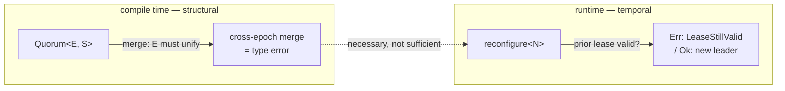

# Split-Brain, Unrepresentable

A type can make the bad state impossible to write down and still fail to make it impossible to reach.

<!-- more -->

## A warp is the friendliest distributed system

[What the Type Erases To](what-the-type-erases-to.md) told one half of a story: a GPU warp is 32 threads in lockstep, and a phantom type can track which lanes are live so that a shuffle on a diverged warp is not a runtime error but a *missing method*. The compiler rejects it the way it rejects `.sin()` on a `String`, then erases every trace of the check from the binary. The guarantee is complete because the setting is forgiving — a warp has fixed membership, no partitions, and lanes that never crash. Merging two halves back into a whole is a total operation. It cannot fail, so the type never has to reason about what happens when it does.

That last sentence is the whole reason to write quorum-types. A GPU warp is a *degenerate best case* of a distributed system: the one where nothing goes wrong. `warp-types` is therefore already an ownership/session type system specialized to the friendliest cluster in existence. The question this repo asks is narrow and mechanical — what has to change when you remove the assumption that membership is stable and holders never die? Where does the structural guarantee keep working, and where does it quietly stop?

That question has two siblings in the back catalogue, each pushing the same erase-to-nothing structural discipline in a different direction. [Intervals Collapse to Points](intervals-collapse-to-points.md) turned it on *timing*, where deterministic hardware collapses a timed session type's intervals to single points; [The Proof That Caught a Wire](the-proof-that-caught-a-wire.md) turned it on *proof*, where a structural check surfaced a real channel-direction bug. Distribution is the third direction, and the least forgiving of the three.

The starting move is the obvious generalization. A distributed system reconfigures: it changes its membership set and stamps each configuration with an **epoch**, a monotonically increasing generation number. The failure everyone fears is *split-brain* — two nodes from different epochs both believing they are the leader, both serving writes, both correct according to their own view. So lift the epoch into the type. Make a membership token carry its epoch as a `const` generic, and make the recombine operation require that both halves agree on it.

## The compile error that feels like a proof

The base module is thirty minutes of Rust. A `Quorum<const E: u64, S>` is a move-only token — no `Copy`, no `Clone` — carrying a runtime membership bitmask, a type-level epoch `E`, and a type-level active-set marker `S` (`All`, `Lo`, or `Hi`). You split a full quorum into complementary halves at the same epoch, and you merge two complementary halves back:

```rust
pub fn merge<const E: u64, A, B>(a: Quorum<E, A>, b: Quorum<E, B>) -> Quorum<E, All>
where
    A: ComplementOf<B>,
    B: ActiveSet,
{
    Quorum { members: a.members | b.members, _set: PhantomData }
}
```

The signature is the argument. Both arguments name the *same* `E`. Hand `merge` a half from epoch 3 and a half from epoch 4 and there is no `E` that unifies the two — the borrow checker never even runs, because type inference has already failed:

```text
error[E0308]: mismatched types
  expected `Quorum<3, _>`, found `Quorum<4, _>`
```

`expected 3, found 4`. Split-brain across epochs is not caught at runtime and it is not a panic. It is a value that cannot be constructed. The `ComplementOf` bound does the same work in the set dimension — `Lo`'s only registered complement is `Hi`, so merging two `Lo` halves fails to unify the second argument's type — and move semantics do it in the linearity dimension, since a token consumed by one `merge` is gone and a second use is a use-after-move. Three different unrepresentable states, all discharged by the compiler with nothing left in the binary.

It is a genuinely satisfying result, and it is a trap. The feeling it produces — *I have made split-brain impossible* — is exactly the feeling the rest of the project exists to correct.

## Necessary, not sufficient

Here is what the compile error does not say: nothing about it prevents an old leader from continuing to serve.

Split-brain is not fundamentally a fact about *merging*. It is a fact about *time*. When a cluster reconfigures away from a leader it believes has failed — because it is unreachable, partitioned behind a dead switch — that leader does not necessarily know it has been superseded. It holds a lease that has not yet expired from its own perspective, and it keeps answering. The new epoch forms; the old leader serves on. For a window bounded by the old lease, two leaders exist. No merge ever happens between them. The type-level epoch is untouched, correct, and completely beside the point.

This is the shape worth naming precisely: a structural guarantee can be **necessary but not sufficient**. The epoch in the type is necessary — without it, a stale half really could be merged into a fresh configuration and corrupt it. But it is not sufficient, because the dangerous state is temporal, and no `const` generic can encode "wait until the previous lease has expired." There is no type whose inhabitant is a proof that a clock has advanced. That obligation lives at runtime or it lives nowhere.

Asserting this is cheap. The interesting part is that a bounded model was needed to *find* it, and finding it was harder than it should have been.

## The model that almost proved nothing

The obligation went to TLA+ — a small protocol model of the lease-degraded complement, checked exhaustively over a bounded state space. The intent was to encode the failover discipline and let the model checker either bless it or produce a counterexample trace.

The first three formulations blessed it. All of them. And every one of them was worthless, for the same reason: they made split-brain *unreachable by construction*. The natural way to model which epoch is authoritative is a function — `mintedAt`, mapping each token to the epoch it was minted at. But a function has one value per input at a time. If authority is derived from `mintedAt`, then at any instant there is at most one authoritative epoch *by definition*, and the safety property "at most one leader" holds trivially. The model was not proving the protocol safe. It was proving that the way I had written down the state made the bad state inexpressible — which is a fact about my notation, not about the protocol. A green check on a model that cannot represent the failure is worse than no check, because it looks like evidence.

The fix was to stop deriving authority and start *latching* it. Introduce a separate `serving` set — the epochs whose leaders currently believe they are authoritative — decoupled from the current tokens. A partitioned old leader stays in `serving` until it explicitly lapses, precisely because it does not yet know it was superseded. Now split-brain is representable: `serving` can hold two epochs at once. Whether it *does* is what the model actually has to check.

With `serving` latched, one single precondition carries all the safety. A new configuration may form only when no prior leader is still serving:

```text
Form(e) ==
    /\ ...both halves alive and minted at e...
    /\ e \notin serving
    /\ (EnforceLeaseGuard => serving = {})   \* the load-bearing line
    /\ serving' = serving \cup {e}
```

`EnforceLeaseGuard` is a constant. Flip it and you have a negative control. Guard on: no violation across 36 distinct states — the whole reachable space under the bound. Guard off: the checker finds split-brain at depth 4, and prints the trace that produces it:

```text
Form(0)          \* leader forms at epoch 0, serving = {0}
Reconfigure      \* suspected failure, epoch advances to 1
Form(1)          \* new leader forms — old one never lapsed
                 \* serving = {0, 1}  →  NoSplitBrain violated
```

That trace is the entire thesis in four steps. The old leader was never told to stop. It kept serving. The new one formed anyway. The type system, which is watching the epoch on the tokens, saw nothing wrong — because at the type level, nothing *was* wrong. A guarded model that merely passes proves little on its own; deliberately breaking the one guard and confirming the checker *finds* the failure is what shows the guard is load-bearing rather than decorative.

## Where structure ends and discipline begins

If the missing guard is temporal, it has to be a runtime check. The failover layer encodes exactly that boundary: `reconfigure` mints a full quorum at a new epoch, but only once the prior lease has lapsed at the current logical time.

```rust
pub fn reconfigure<const N: u64>(
    prior_lease: Lease,
    now: Tick,
    new_members: u32,
    new_lease: Lease,
) -> Result<Leased<N, All>, FailoverError> {
    if prior_lease.is_valid(now) {
        return Err(FailoverError::LeaseStillValid { until: prior_lease.expires_after() });
    }
    Ok(Leased::genesis(new_members, new_lease))
}
```

The `Result` is the point, not a concession. It is the `Form` guard from the model, relocated to the exact seam where static epoch tracking hands off to a dynamic clock. Encoding it forced three honest admissions into the open, and the discipline was refusing to paper over any of them.

The guard *wants* to be a type bound and cannot be one — split-brain is temporal, so the check runs, and the `Result` is where structure ends. Second, the ordering that reconfiguration relies on — that the new epoch `N` exceeds the superseded one — is unstatable on stable Rust; there is no way to write `N > E` as a bound on two `const` generics without unstable features, so it is a documented boundary invariant rather than a faked type constraint. That gap *is* the literal shape of "necessary but not sufficient" showing up in the source. Third, Rust's affinity is not linearity: `#[must_use]` catches an ignored return value, but nothing forces a live lease token to be surrendered before it drops out of scope. True must-consume would need a panicking `Drop`, left out deliberately. `surrender` refuses to release a still-valid lease, but it cannot force itself to be called.

Each of these is a place where the type system genuinely stops and runtime discipline genuinely begins. The value of the encoding is that it does not let you pretend the boundary is somewhere more flattering than it is.



## Validation that isn't circular

A model and a runtime guard are two artifacts that could each be internally consistent and jointly wrong. The partition/heal test closes that gap by refusing to re-decide anything. It is a deterministic in-process simulation — no network, because there is no wire protocol yet to simulate — that drives the *real* `reconfigure` through a crash, a partition, and a heal, replaying the counterexample trace as an executable scenario and asserting the model's `NoSplitBrain` property at every step.

The property that makes it evidence rather than theater is that the safety *decision* is delegated. When the sim reaches the point where a premature failover is attempted while the old lease is still valid, it does not check the lease itself. It calls `reconfigure` and respects the `Result`. If the guard were broken — returning `Ok` while the lease is live — the harness would crown a second leader, `serving` would hold two epochs, and the `NoSplitBrain` assertion would fail. The test cannot pass with a broken guard, because it exercises the library instead of re-implementing it. A companion check sweeps the whole time domain and confirms `reconfigure` returns `Ok` if and only if the attempt is strictly after the prior lease expires; the refusal window matches the old lease's lifetime exactly, tick for tick.

There is one more friction worth reporting because it is on-thesis rather than in spite of it. `Leased<const E, All>` fixes the epoch in the type, so a runtime loop cannot bump the epoch into a variable — the sim has to use concrete epochs 0, 1, 2 with explicit turbofish. That is the const-generic seam from the type layer resurfacing in the test layer, and it is exactly right: the type-level epoch is a *within-configuration* invariant, and a simulator that steps through configurations necessarily lives on the dynamic side of the boundary. The tool did not fit, and the way it failed to fit pointed straight at where the boundary is.

## What the contrast with warp-types actually shows

The clean way to state the result is by holding it against its parent. In `warp-types`, the structural guarantee *is* sufficient. A shuffle on a diverged warp is impossible to write, and that is the end of the safety argument, because a warp lane never fails, never partitions, and never keeps executing a stale configuration behind a network split. Sufficiency there is not a property of the type system's cleverness. It is a gift from the domain. The whole reason the guarantee holds completely is the no-failure assumption baked into the hardware.

quorum-types is the same type-level mechanism with that one assumption removed, and removing it is precisely what breaks sufficiency. The epoch-indexed merge is every bit as airtight as the warp's typed divergence — cross-epoch merge is a compile error, full stop. But airtight in the structural dimension buys nothing in the temporal one, because failure introduces a dangerous state that has no representation in any type: an old leader, correct about its own epoch, still serving. Same technique, strictly harder world, and the delta between them is exactly the temporal guard the type cannot hold. The generalization is honest because it identifies its own limit rather than hiding it.

## Scope, honestly

This is a feasibility study, not a consensus library. There is no transport, no message protocol, no real-time lease, no Byzantine tolerance, and no more than a two-way static split in the base module. The TLA+ model is bounded — `MaxEpoch = 2`, two halves — so every result is "holds in the checked domain," not "proven in general." The property tests cover small integer ranges. A real reconfigurable consensus system answers the cross-configuration hazard either by forcing overlapping joint majorities across configurations, the way Raft does, or by sequencing configurations behind a leader lease, which is the lineage this toy follows. Arriving at that fork by starting from "generalize warp-types" and following each limitation to the next result is reassuring precisely because the model reproduced known wisdom rather than inventing something that only looks right — it is not a claim to have built either.

The transferable part is not the distributed-systems content. It is the shape of the finding. A structural type guarantee can feel complete, pass every compile check, erase to nothing, and still be necessary but not sufficient — and the way you discover the gap is by trying to prove the guarantee holds, watching the proof come up trivially green, and being suspicious enough to ask whether the bad state was even representable in what you wrote down. It usually wasn't. That is where the real check begins.

---

🦬☀️ *quorum-types is a feasibility study — a distributed-systems generalization of warp-types. [GitHub](https://github.com/modelmiser/quorum-types).*
