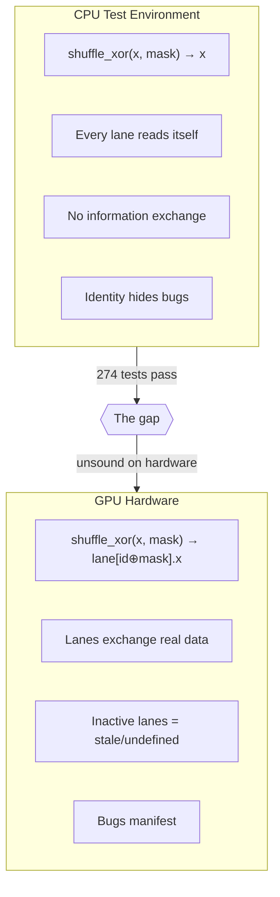

# The Bug That Wasn't There

A one-line soundness hole that zero tests caught and zero users triggered.

<!-- more -->

[warp-types](../../research/warp-types.md) encodes GPU warp divergence state in Rust's type system. Its core type, `Warp<S>`, is a zero-sized phantom that tracks which lanes are active at compile time. The safety guarantee is simple: once you diverge a warp, the original handle is consumed. You get it back only by merging both halves. Each warp token is used exactly once — an affine discipline enforced by Rust's move semantics.

The entire type system rests on this property. And for the first several months, a single `derive` attribute silently invalidated it.

## The derive

`Warp<S>` derived `Copy`.

It seemed natural. `Warp<S>` is zero-sized — it's `PhantomData<S>` in a wrapper. `PhantomData` derives `Copy`. Zero-sized types are free to copy. Why wouldn't `Warp`?

Because `Copy` violates the one property the type system exists to enforce.

```rust
let warp = Warp::<All>::kernel_entry();
let (even, odd) = warp.diverge_even_odd();
// With Copy, `warp` wasn't consumed — it was silently copied.
// The original handle is still live:
warp.shuffle_xor(data, 1); // Compiles. Runs. Reads from inactive lanes.
```

This compiles in safe Rust. No `unsafe`, no escape hatches. A user following the normal API can accidentally write code that shuffles on a warp where half the lanes are inactive. That's the exact bug class the type system was built to prevent — reading stale or undefined values from lanes that have diverged to a different control path.

On actual GPU hardware, `shuffle_xor` on a partially-active warp reads whatever happens to be in the inactive lanes' registers. The result depends on execution history, scheduling order, and hardware generation. NVIDIA's pre-Volta architectures masked this with implicit lockstep execution; post-Volta, the behavior is explicitly undefined per the PTX ISA. It's the kind of bug that works on your test GPU and fails on your customer's.

## Why 274 tests didn't catch it

Every test passed. Not "most tests." All 274. The Copy derive was there from the beginning, and no test ever exploited it — not because the tests were well-designed to avoid it, but because nobody wrote code that used a warp handle twice. The API's ergonomics naturally led to linear usage. You diverge, you work with the halves, you merge. Nobody had a reason to reuse the original.

But "nobody happened to" is different from "nobody can." The type system's job is to make the latter true. With `Copy` derived, it was making only the weaker guarantee.

There's a second, deeper reason the tests couldn't catch this bug even if someone had written the exploit: the CPU shuffle implementation.

On CPU — where all tests run — the shuffle functions are identity:

```rust
// CPU fallback (non-GPU targets)
fn gpu_shfl_xor(self, _: u32) -> Self { self }
```

Every lane reads its own value. The information exchange that triggers the real bug — lane 0 reading lane 1's data, which on a diverged warp means reading from an inactive lane's stale register — never happens. The CPU test path eliminates the mechanism by which the bug manifests.

This is the same pattern behind NVIDIA's PIConGPU bug (#2514), which ran undetected for months on K80 hardware. Pre-Volta implicit lockstep execution meant that all lanes appeared active even when the programming model said they weren't. The bug was real — undefined behavior per the CUDA spec — though no wrong output was ever observed on pre-Volta hardware, where implicit lockstep execution masked the violation. The fix was preventive, not reactive. And the test environment structurally prevented detection.

## Three paths to the same bug

Multiple independent code reviews examined the crate from different analytical angles. Three of them found the `Copy` bug independently, arriving from different directions.

The first approached from the **affine-vs-linear regime boundary**: what ownership discipline does the soundness proof actually require? The proof says each warp token is consumed at most once. `Copy` creates an implicit second token. Finding: soundness depends on a property the code doesn't enforce.

The second approached from **assumption inventory**: list every assumption the soundness proof makes, then check each one against the implementation. One assumption: "the `diverge` method is the only way to obtain a sub-warp handle." Another: "the parent handle is destroyed when diverge runs." The second assumption fails with `Copy` — the parent handle survives because the compiler copies it instead of moving it.

The third approached from **conservation law analysis**: in a sound system, the number of live warp tokens at each diverge level is conserved. `diverge` creates two child tokens and destroys one parent. `merge` destroys two children and creates one parent. With `Copy`, `diverge` creates two children and the parent survives — three tokens where there should be two. Conservation is violated.

Three independent paths to the same conclusion. That convergence is the strongest signal a finding is real.

## The fix and what it proved

```rust
// Before
#[derive(Copy, Clone)]
pub struct Warp<S: ActiveSet> {
    _phantom: PhantomData<S>,
}

// After
#[must_use]
pub struct Warp<S: ActiveSet> {
    _phantom: PhantomData<S>,
}
```

Remove `Copy`. Remove `Clone`. Two words deleted.

Zero tests broke. All 274 passed immediately.

This is the important part. Zero breakage means every existing usage was already linear. Nobody was relying on `Copy` — not in the tests, not in the examples, not in the reproduction cases for five real-world GPU bugs. The code was empirically sound. The fix closed the gap between empirical and provable.

This is the safety-factor pattern in engineering. A bridge rated for 10 tons that only carries 5-ton trucks is never in danger — but the engineer who discovers the rating should have been 12 tons still fixes it. The fix changes nothing for correct traffic and everything for the truck that weighs 11.

## The CPU identity trap

The `Copy` bug is specific and fixable. The CPU identity shuffle is a structural problem with the entire testing approach.

The CPU shuffle fallback — `fn gpu_shfl_xor(self, _mask: u32) -> Self { self }` — is a correct single-threaded emulation. A warp has one thread on CPU. That thread can only read its own value. The identity function is the right semantics.

But identity eliminates information exchange. And information exchange is the mechanism by which warp-level bugs manifest. Two more bugs that survived ten or more review passes were in the same class:

**Bitonic sort `compare_swap`.** The sort compares a lane's value with its partner's value via shuffle, keeping the minimum or maximum based on sort direction. On GPU, lane 0 sees lane 1's distinct value. Both lanes independently evaluate `if my <= partner` and take the appropriate element. On CPU, `my == partner` (identity shuffle), so the comparison is trivially correct regardless of sort direction. The bug — both lanes taking the minimum, destroying the maximum — only appears when the two values differ. They never differ on CPU.

**Tile segment confinement.** `Tile<8>::shuffle_xor(data, 8)` should be an error — XOR mask 8 reaches outside an 8-lane tile. On GPU, lane 0 would exchange with lane 8, which belongs to a different tile. On CPU, the identity shuffle means lane 0 reads itself. The boundary violation is invisible because no boundary is crossed when every lane reads its own data.

The pattern across all three: CPU identity shuffles satisfy the functional interface contract but eliminate the information exchange that triggers the real bugs. The tests don't fail because the mechanism that would produce failure doesn't exist in the test environment.

This is not a solvable problem within the CPU-testing paradigm. You can't test information exchange without information exchange. The `simwarp` module — a multi-lane warp simulator with real shuffle semantics — exists specifically to close this gap. But the point stands: CPU-only testing of a GPU type system has a fundamental blind spot, and the blind spot is precisely aligned with the bug class you care about most.



## Sealing the other hole

Removing `Copy` closed the duplication path. But there was a second way to forge warp tokens.

The `ActiveSet` and `ComplementOf` traits were public. An external crate could implement them with arbitrary masks, then construct `Warp<All>` handles that don't correspond to actual lane states. The type system says "if you hold a `Warp<All>`, all 32 lanes are active." An external implementation says "I defined `MyFakeAll` with `MASK = 0x1` and implemented `ComplementOf<MyFakeOdd>` for it." The compiler accepts this. The invariant is violated.

The fix is the sealed trait pattern:

```rust
pub mod sealed {
    pub(crate) struct SealToken;

    pub trait Sealed {
        fn _sealed() -> SealToken;
    }
}

pub trait ActiveSet: sealed::Sealed + Copy + 'static {
    const MASK: u64;
    const NAME: &'static str;
}
```

`SealToken` is `pub(crate)`. External crates can't name it. They can't implement the `_sealed` method. They can't implement `ActiveSet`. The set of valid active sets is exactly the set defined in the crate.

Combined with the `Copy` removal: you can't forge warp tokens (sealed traits), and you can't duplicate them (no `Copy`). The two properties the soundness proof requires — token authenticity and token uniqueness — are now actually enforced by the compiler rather than assumed by convention.

## What this generalizes to

The `Copy` bug is a specific instance of a general pattern: phantom-type libraries where soundness depends on affine usage. Any crate that uses zero-sized types as capability tokens — file handles, session tokens, protocol state markers — has the same vulnerability if those types derive `Copy` or `Clone`.

The audit takes thirty seconds. Search for `derive(Copy` or `derive(Clone` on every type whose safety story depends on "used at most once." If you find one, check whether any existing code exploits the copy. If not, remove the derive and verify that nothing breaks. If nothing does, you just closed a latent soundness hole at zero cost.

The broader landscape has three approaches to warp divergence safety. CUDA's status quo allows divergence and checks nothing — `__shfl_sync` accepts any mask, and a wrong mask produces silent corruption. The Hazy research compiler prohibits divergence entirely, forcing megakernel designs where all lanes always execute — safe, but it forecloses algorithms that depend on sub-warp communication. warp-types is a third path: allow divergence, enforce safety at compile time. The `Copy` bug mattered because it broke the mechanism distinguishing Path 3 from Path 1 — without affine discipline, the type system degrades to the same "check nothing" posture as raw CUDA intrinsics.

The CPU identity shuffle trap is equally general. Any type system for a parallel execution model, tested on a sequential emulation, will have this blind spot. The emulation correctly models the single-thread behavior and structurally cannot model the inter-thread interaction where the bugs live. This isn't a reason to skip CPU testing — it's a reason to know what CPU testing can't tell you.

"Zero tests broke" after a soundness fix is either good news or a warning. It's good news if the fix was closing a latent hole — nobody was exploiting the unsoundness, and the fix cost nothing. It's a warning if you're not sure — because the alternative explanation is that your tests don't cover the attack surface. Here, it was the good news. But you can't know that without looking.

---

🦬☀️ *warp-types is a type-safe GPU warp library on [crates.io](https://crates.io/crates/warp-types). [GitHub](https://github.com/modelmiser/warp-types).*
