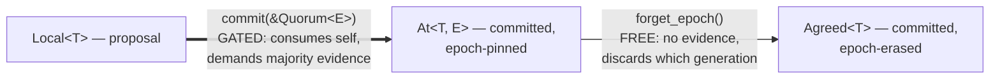

# Up Is Gated, Down Is Free

A value's consensus strength forms a small lattice of levels, and the types that carry it are built from one asymmetry: earning a guarantee demands evidence, discarding one demands nothing.

<!-- more -->

## What the arc skipped

This is the fourth post on quorum-types, a feasibility study asking whether the compile-time safety of [warp-types](what-the-type-erases-to.md) — a type system for GPU warps, the fixed squads of lanes that execute in lockstep — survives the move to a distributed system. The three posts before this one typed the *membership*. [Split-Brain, Unrepresentable](split-brain-unrepresentable.md) lifted the configuration epoch — the cluster's generation counter, bumped at every membership change — into a `const` generic so cross-epoch merges fail to unify. [Disjoint Becomes Intersecting](disjoint-becomes-intersecting.md) flipped the set relation and made a `Quorum<E>` token structural evidence of majority. [Where Structure Ends](where-structure-ends.md) composed the structural and temporal guards and found the seam between them. Every one of those answers the same question: *who may act*.

None of them says a word about what has been *decided*. The data the quorums exist to agree on — the actual payload — has been a bare Rust value the whole time. Nothing in any type distinguishes `"x = 42"` as a fact a majority committed from `"x = 42"` as a guess this node hopes is true. That distinction is the entire reason consensus exists, and until the last module it lived nowhere. `src/consistency.rs` turns the arc's discipline on the values themselves, and the shape that falls out is small enough to state in one sentence: a value's consensus strength is a three-level lattice — the top level indexed by epoch — and no evidence-free move points up.

## Three wrappers, one direction

The lattice has three wrappers, all move-only — no `Copy`, no `Clone`. `Local<T>` is the bottom: this node's uncommitted view, a *proposal*. `At<T, E>` is the top: committed, and pinned to the exact configuration epoch `E` that agreed to it. `Agreed<T>` sits between them: committed by *some* quorum, generation forgotten. Two moves connect them, and their signatures are the whole argument.

The up-move:

```rust
impl<T> Local<T> {
    pub fn commit<const E: u64>(self, _witness: &Quorum<E>) -> At<T, E> {
        At { value: self.value }
    }
}
```

The down-move:

```rust
impl<T, const E: u64> At<T, E> {
    pub fn forget_epoch(self) -> Agreed<T> {
        Agreed { value: self.value }
    }
}
```

Read the bodies first: they do nothing. Both are field-to-field moves. All the content is in the signatures. `commit` consumes the proposal — `self` by value, so a stale `Local` cannot be committed twice — and demands a `&Quorum<E>`, the certified-majority token from [the membership layer](disjoint-becomes-intersecting.md), as *evidence* that a majority of configuration `E` exists to witness the value. The epoch `E` is inferred from the witness and pinned into the result type; you do not choose it, the evidence does. Note that the witness is only *borrowed* — what that means is bounded honestly below. `forget_epoch` asks for no evidence at all, only the value it consumes. Nothing is checked, because there is nothing to check.



*The arrows are the moves, not the ordering — in lattice height, `Agreed` sits between `Local` and `At`.*

Here is the part worth writing a post about: the asymmetry was not a design decision. There was no moment of weighing "should the down-move also require a quorum?" against ergonomics. It fell out of asking what is *sound*. Weakening a consistency guarantee — forgetting which generation agreed — can never cause a safety violation, because every action legal on the weaker type was already legal on the stronger one. So the down-move needs no evidence; a check there would verify nothing. Strengthening a guarantee — turning a local guess into a committed fact — is precisely the operation consensus performs, so the up-move demanding a quorum is not the type system *modeling* consensus. It is the type system refusing to let anything else stand in for it.

## Possession is proof

The consequence with teeth is unforgeability. `At` and `Agreed` have private fields and no public constructor. The only path into the committed upper set is `commit`, and `commit` cannot be called without a `&Quorum<E>` — which itself originates only in `Config::certify`, the runtime boundary that counts an actual majority. Chain those two facts and you get something no runtime flag provides: *possessing* an `Agreed<T>` is proof its commit was witnessed by a real certified quorum. Not a claim, not a field named `committed: bool` that some code path forgot to set — a proof, carried by the type, checked at zero runtime cost, with no way to counterfeit it in safe code outside the defining crate — and one root-of-trust caveat, conceded at the end.

That turns "act only on decided values" from a code-review convention into a compile error. The lattice's upper set `{Agreed, At}` is named by a sealed trait — and the whole mechanism fits in the excerpt:

```rust
mod sealed { pub trait Sealed {} }   // private module — the seal

pub trait Consistency: sealed::Sealed { const LEVEL: u8; }

pub trait Committed: Consistency {}
```

`Local` implements `Consistency` but deliberately not `Committed`, and because `Consistency` requires the crate-private `Sealed`, no new type outside the crate can join the lattice — while Rust's orphan rule stops downstream code from re-opening the traits for the crate's own types. The upper set is closed. A function that mutates authoritative state bounds its argument on `Committed`, and handing it a proposal is rejected before the borrow checker runs:

```rust
fn apply<C: Committed>(_decided: C) { /* mutate authoritative state */ }
apply(Local::new("x = 42")); // E0277: `Local<&str>: Committed` is not satisfied
```

## The epoch guards the data too

The discipline the arc built for membership extends to the values. `At<T, 7>` cannot stand in for `At<T, 3>` — a value agreed by configuration 7 was not agreed by configuration 3, and after a membership change those are different sets of machines with no overlap guarantee. The rejection is the same `E0308` that refused cross-epoch `merge` in the [first post](split-brain-unrepresentable.md) and cross-epoch `intersect` in the [second](disjoint-becomes-intersecting.md). One guard, three layers, each application cheaper than the last: the epoch was already in the `Quorum`, and `commit` just lets it flow through into the value's type.

Nor does the guard conflict with free erasure — `forget_epoch` produces exactly the claim a `Committed`-bounded consumer asks for ("*some* quorum committed this"), and a consumer for whom the generation matters says so in its type by demanding `At<T, 3>`, which no `Agreed`, from any epoch, can satisfy.

Even the lattice's ordering is a compile-time fact rather than a comment. Each level carries a `const LEVEL: u8`, and a `const` assertion checks `Local < Agreed < At` at build time — reshuffle the levels in a future edit and the crate fails to compile instead of silently inverting what "stronger" means.

## The same seam, one more consumer

If the shape feels familiar, it should. `Config::certify` is a runtime check that mints a typed token — look at the actual subset once, count it against the threshold, and only then produce a `Quorum<E>` that everything downstream trusts structurally. That is the *gradual* boundary the series keeps meeting — a runtime check at the edge of a statically trusted core: check at the edge, trade on the type inside. `commit` is that pattern applied to data, with one refinement worth noticing — it performs *no check of its own*. It spends evidence minted at the earlier boundary. The counting happened exactly once, in `certify`; `commit` just requires that you hold the receipt. The membership-to-data path has a single point where runtime facts become type-level guarantees, and the consistency lattice did not add a second one — it added a new consumer of the first. (The crate's other runtime seams — the lease checks in failover and reconfiguration — are the same boundary shape guarding a different regime.)

## Where the invariant lives elsewhere

The contrast that makes this concrete is how mainstream consensus implementations mark committedness. In Raft, an entry becomes committed once the leader has replicated it on a majority in its current term — and committedness is then *knowledge that spreads*: every server tracks a `commitIndex`, a plain integer marking the highest entry it knows to be committed. Whether code may act on an entry is a comparison against that integer, and every code path that *acts* on an entry — applying it, serving a read from it — must remember to make it. The type of a log entry is identical before and after commitment; nothing but discipline separates "appended" from "committed" from "applied," and the paper devotes real care to which comparisons are safe when (a leader may not count replicas alone to commit an entry from a previous term — that is the kind of rule that lives in prose and review, not in types).

None of this is a criticism of Raft; a wire protocol needs indices, and an implementation tracks them correctly or fails its test suite. The observation is about where the invariant lives. There, committedness is a predicate any code path can evaluate — or forget to. Here it is a type distinction: a function that states the `Committed` bound cannot be handed anything less. The discipline does not vanish — it concentrates into signatures — but a signature is checked once, by the compiler, instead of remembered at every call site.

## A Haskell ancestor

Haskell got to the underlying idea early. Noonan's *Ghosts of Departed Proofs* (GoDP; Haskell Symposium 2018) attaches proofs to values through phantom type parameters: a `Named name a` whose `name` is introduced fresh by a rank-2 continuation, a scoped callback that is the only place the name exists. Facts established about one value can then be trusted wherever its name appears. `Agreed<T>` is squarely in that lineage: the type is the proof, and the proof costs nothing at runtime. The difference is what the phantom parameter *is*. GoDP's names are existentially quantified — fresh, scoped, deliberately unrelatable across separate introductions: every introduction mints a name nothing else can mention, so two separately named values can never be confused, or combined. The epoch here is a concrete `const u64`, global to the crate, which is exactly what this domain needs: two `At<T, 7>` values minted at different call sites *should* interoperate, because epoch 7 is one shared fact about the cluster, not a local scope. Const generics give up freshness and buy cross-site agreement — the right trade when the phantom tracks a real generation number instead of an abstract name.

## What the wrapper does not promise

The register of this arc is naming what the types cannot do, and the coda is no exception.

The witness proves less than it appears to. Holding a `&Quorum<E>` at commit time proves a majority of configuration `E` was certified — not that the value was *replicated* to those members, and not that they *voted* on it. There is no voting here; there is no wire protocol for votes to travel on. `commit` records "a quorum existed to witness this," which is the feasibility-toy stand-in for a commit protocol, not the protocol itself. A real system would need the quorum's members to durably store the value before anything deserves the name `Agreed`, and this toy does not model durability at all.

Because the witness is borrowed rather than consumed, one `&Quorum<E>` can bless any number of commits — mutually contradictory ones included. (This membership-layer `Quorum` is even `Clone` — unlike the [first post's](split-brain-unrepresentable.md) move-only base token, it is a reusable fact about the configuration, not a linear capability; copying a certificate is not forging one.) That is consistent with what the witness actually proves (the quorum *exists*), and it is exactly why this is witnessing rather than voting: per-decision evidence would need a one-shot certificate, consumed by the single commit it authorizes.

The chain also has a root the types cannot vouch for: `Config::new` accepts whatever member set it is handed, so safe code outside the crate can build a one-node `Config<7>`, certify a "majority" of it, and commit through the result. The types prove every link from *a* configuration; only the operator makes it *the* configuration.

Rust's affinity is not linearity, a limit the [first post](split-brain-unrepresentable.md) already had to concede for leases, and it recurs here unchanged: a `Local<T>` can simply be dropped. `#[must_use]` warns when a fresh proposal's result is ignored outright, but a `Local` bound to a variable drops silently at scope end — and either way a warning is not an obligation. Nothing forces every proposal to be either committed or explicitly rejected. The `Committed` bound is also opt-in: a function that takes a bare `T` sits outside the system entirely, and nothing forces code that mutates authoritative state to state the bound — the lattice protects the signatures that ask for protection.

The lattice of levels is also as small as its three distinctions allow: three levels, one chain — which makes its order-theoretic joins trivial — and means what is missing is not a join at all but *reconciliation*: nothing merges two `Agreed` values that disagree. That is where a real system's conflict story would start, and where this toy deliberately stops.

## Trusting the checks themselves

The evidence for the module itself: 4 unit tests, 1 doctest, and 3 `compile_fail` doctests. That last trio hides a trap that echoes the [TLA+ lesson](split-brain-unrepresentable.md) from the start of the arc. A `compile_fail` doctest passes if the snippet fails to compile *for any reason* — a typo passes it, a missing import passes it. A green `compile_fail` proves an error exists, not that it is the error you designed. So each of the three was reason-verified against standalone `rustc`: `E0277` for the `Committed` bound rejecting `Local`, `E0308` for the cross-epoch substitution, `E0382` for the use-after-move of a consumed proposal. Same discipline as flipping `EnforceLeaseGuard` off to watch the model checker find the violation: a check that cannot fail for the right reason is not yet evidence, no matter how green it is.

## The last row

With the consistency lattice in place, the mapping this series has been building one piece at a time can finally be laid out whole — and every row of it now has a typed model:

| A GPU warp assumes | A cluster gets | Typed in |
|---|---|---|
| one fixed generation of lanes | epoch-indexed configurations — cross-epoch merge fails to unify | [Split-Brain, Unrepresentable](split-brain-unrepresentable.md) |
| divergence into *disjoint* complements | failure into *intersecting* quorums | [Disjoint Becomes Intersecting](disjoint-becomes-intersecting.md) |
| lockstep — structure alone suffices | a lease where structure cannot reach | [Where Structure Ends](where-structure-ends.md) |
| values trusted because lanes never disagree | a consistency lattice over values — `Local` gated up to `At`, freely weakened to `Agreed` | this post |

The last row restates the whole project in miniature. Information can always be thrown away for free, because forgetting is sound. It can only be earned at a checked boundary, because earning it *is* the consensus. Down is free. Up is gated. The type system's job is to make sure nothing sneaks up the back way — and its honesty is in how little it claims about everything else. The [third post's](where-structure-ends.md) closing question — whether any of this scales to a real protocol — stays open; the toy stops exactly where a wire protocol, durability, and reconciliation would begin.

---

🦬☀️ *quorum-types is a feasibility study — a distributed-systems generalization of warp-types. [GitHub](https://github.com/modelmiser/quorum-types).*
