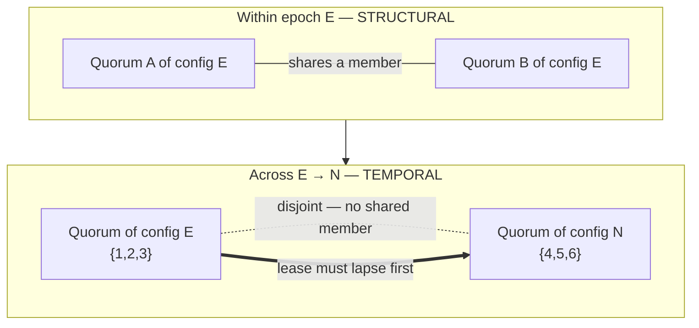

# Where Structure Ends

A reconfigurable quorum system has two safety mechanisms that look redundant. They are not — they partition the problem by regime.

<!-- more -->

This is the last of three posts on quorum-types, a feasibility study that asks whether the compile-time safety of [warp-types](what-the-type-erases-to.md) survives the move from a GPU warp to a distributed system. The first, [Split-Brain, Unrepresentable](split-brain-unrepresentable.md), lifted a configuration epoch into the type so that merging two generations' quorums fails to compile — and then showed a bounded model proving that compile-time guard is necessary but not sufficient. The second, [Disjoint Becomes Intersecting](disjoint-becomes-intersecting.md), flipped the set relation: a warp partitions its lanes into disjoint complements, but a failure-tolerant cluster forms quorums that must *overlap*. This post composes the two halves and finds the seam between them.

## Two mechanisms, one suspicion

By the time the pieces were built, quorum-types had two independent safety guards. One is *structural*: within a single configuration, any two majorities intersect, so two would-be leaders cannot both act without sharing a member — and a shared member can refuse to endorse both. That guard is discharged by set arithmetic. Certify a subset as a `Quorum<E>` only if it reaches `⌊n/2⌋ + 1`; then two such subsets have sizes summing to at least `n + 1 > n`, so by inclusion–exclusion they meet. Nothing runs at intersection time — the certificate carries the guarantee.

The other guard is *temporal*: a leader holds a lease, and no successor may be crowned until that lease lapses. This is a runtime check — `reconfigure` returns a `Result`, refusing to mint a new quorum while the prior lease is still valid. The first post established why it has to be runtime: split-brain is a fact about *time*, and no type can express "wait for the old lease to expire."

Having both invites an obvious question. If the type system already makes cross-epoch merges uncompilable, and majority intersection already forces agreement, why also carry a lease? It smells like belt and suspenders — two mechanisms guarding one hole. Composing them into a single type, `LeasedQuorum<E>`, was supposed to be tidying. It turned out to answer a question I hadn't stated precisely: the two guards are not redundant, and the reason they aren't is the whole point of the project.

## The disjoint case

Structural safety rests entirely on one sentence: *any two majorities of the same configuration intersect.* Read it again with emphasis on *same*. The intersection argument is counting members of one fixed set. The instant the configuration changes — the moment membership goes dynamic, which is the entire reason this system exists — that argument has nothing to count.

Consider a cluster reconfiguring from `{1, 2, 3}` to `{4, 5, 6}`. Every node is replaced. A majority of the old config is `{1, 2, 3}`; a majority of the new config is `{4, 5, 6}`. These sets are disjoint. There is no shared member, so there is nothing to refuse a double endorsement. Intersection safety offers exactly zero protection across a configuration boundary, because the thing it protects — a common member — need not exist.

The toy proves this rather than asserting it:

```rust
#[test]
fn across_epoch_quorums_can_be_disjoint() {
    let old = cfg::<0>([1, 2, 3]);
    let new = cfg::<1>([4, 5, 6]);
    let q_old = LeasedQuorum::certify(&old, BTreeSet::from([1, 2, 3]), l).unwrap();
    let q_new = LeasedQuorum::certify(&new, BTreeSet::from([4, 5, 6]), /* … */).unwrap();

    assert!(q_old.members().is_disjoint(q_new.members()));
    // The type system won't even let us call q_old.intersect(&q_new):
    // LeasedQuorum<0> vs LeasedQuorum<1>. Safety here is purely lease ordering.
}
```

Two things happen in that test, and the second is the interesting one. The runtime assertion confirms the member sets share nothing. But `intersect` is not even callable — its signature is `fn intersect(&self, other: &LeasedQuorum<E>)`, so both arguments carry the *same* `E`. A `LeasedQuorum<0>` and a `LeasedQuorum<1>` cannot be passed to it; the compiler refuses. The type system has drawn a hard line around exactly the regime where intersection is meaningful and forbidden you from asking the question everywhere else. That is not a limitation to work around. It is the type telling the truth: across epochs, intersection is not a safety property, so the operation that computes it should not typecheck.

If intersection is silent across the boundary, something else has to sequence old before new. That something is the lease.

## Each covers what the other cannot

Here is the partition, stated cleanly. Within one configuration, safety is structural — the majority overlap forces agreement, and it is enforced by construction, nothing runs. Across a configuration change, safety is temporal — the member sets can be entirely disjoint, so only a leader lease, expiring the old regime before the new one forms, prevents two leaders from both acting.



Neither mechanism covers both regimes. The lease says nothing about whether a given set is a majority — a single stale node can hold an expired lease and it will happily let you proceed, majority or not. Intersection says nothing about time — two quorums of the same config always share a member whether or not any lease is valid. Each guard is blind in exactly the regime the other governs. That is why the composition needs both, and why the earlier toys were each incomplete on their own: the failover toy had a lease but static, two-way membership; the membership toy had dynamic quorums but no failure model. A real reconfigurable system lives in both regimes at once.

`reconfigure` is where they meet, at a single runtime boundary:

```rust
pub fn reconfigure<const N: u64>(
    prior_lease: Lease,
    now: Tick,
    new_cfg: &Config<N>,
    new_subset: BTreeSet<NodeId>,
    new_lease: Lease,
) -> Result<LeasedQuorum<N>, ReconfigError> {
    if prior_lease.is_valid(now) {
        return Err(ReconfigError::LeaseStillValid { until: prior_lease.expires_after() });
    }
    LeasedQuorum::certify(new_cfg, new_subset, new_lease).ok_or(ReconfigError::NotAQuorum)
}
```

Two checks, two failure modes, and the error type names which regime rejected the move:

```rust
pub enum ReconfigError {
    LeaseStillValid { until: Tick }, // temporal guard fired
    NotAQuorum,                      // structural guard fired
}
```

The guards are concrete. A lease granted at tick 0 for a term of 5 is valid through tick 5, inclusive. Call `reconfigure` at `now = 3` and the temporal guard fires — `Err(LeaseStillValid { until: 5 })` — even if the proposed set is a perfectly good majority, because the old regime might still be serving. Call it at `now = 6`, one tick after expiry, and the temporal check passes; now the structural check runs, and a two-node subset of a five-node config comes back `Err(NotAQuorum)`. Only an expired lease *and* a genuine majority yields `Ok(LeasedQuorum<N>)`. The order of the two checks matters solely for which error you see first; both must pass. The type you get out is stamped with the new epoch `N`, and from that point its members are governed structurally again — until the next reconfiguration, where the lease takes over once more.

## The fork this arrives at

The cross-configuration hazard — disjoint majorities across a membership change — is not new. It is one of the oldest problems in reconfigurable consensus, and the literature has two standard answers. They are genuinely *different* solutions to the same problem, and the difference is worth stating precisely, because conflating them is the easy mistake.

Raft's joint consensus introduces a transitional configuration `C_old,new` in which a decision requires majorities of *both* the old and new member sets simultaneously. That deliberately manufactures an overlap the raw sets do not have: because a `C_old,new` decision needs a majority in `C_old` *and* a majority in `C_new`, it overlaps any decision taken in either raw configuration, so the intersection argument is restored *during* the transition. Because overlap is forced structurally, Raft does not need a lease to sequence the configs — the two can be live at once and still cannot disagree.

This toy makes the other choice. It does not force overlap; it *sequences*. The old configuration's lease must lapse before the new one forms, so the two are never authoritative at the same logical time, and disjointness stops mattering because the sets are never both live. That is the Chubby lineage — lease-based reconfiguration (Boxwood, too, holds its primaries by lease, over a Paxos core). (Vertical Paxos takes a third route, delegating the ordering to an external reconfiguration master rather than to a lease at all.) Overlap-or-lease is a real fork, and picking the lease branch is a design decision with consequences, not an implementation detail.

The point is not that the toy discovered any of this. The point is that it *arrived* at the fork. The whole build started from "generalize warp-types to a distributed setting" and followed the mechanics wherever they led — flip disjoint to intersecting, notice intersecting fails across configs, reach for a temporal guard. Landing on the exact fork that reconfigurable-consensus designers have stood at for two decades is a faithfulness signal. A generalization that only *looked* right would have invented some clever fourth option that doesn't survive contact with the failure model. Reproducing the known shape of the problem is stronger evidence that the mapping is sound than any novel-looking result would be.

## The recurring boundary

Strip away the distributed-systems vocabulary and this is the same seam that runs through the entire project. In warp-types, the type system erases to nothing because every safety fact — shuffle only on a full warp, no use after diverge — is structural, decidable at compile time, and the GPU warp is the friendliest possible case: fixed membership, lockstep, no failure. The move to a real cluster introduces exactly the facts a type cannot hold: which specific nodes are members right now, and whether enough logical time has passed for an old lease to die. Those are runtime values. So the type keeps carrying the *relations* — the epoch, the majority property — and hands off the *elements* and the *temporal* facts to a runtime certificate at a checked boundary. `Config::certify` is one such boundary. `reconfigure` is another. The `Result` they return is not a failure of the type system; it *is* the type system, marking honestly where its authority ends.

Naming this partition is the whole contribution of the composition step. Structural typing does not "help less" in a distributed setting — it helps in a bounded, nameable region (within a configuration) and defers precisely at the edges (across one). Once you can say which regime you are in, you can say which guard is load-bearing, and you stop looking for a type to enforce something no type can.

The method that produced the arc reliably is visible in retrospect. Each step shrank a bold thesis — "compile-time safety survives the jump to distributed systems" — to the smallest falsifiable toy that could test one claim and stop. Model the part types cannot reach (a bounded TLA+ check found the split-brain the compiler could not). Encode the runtime edge as an explicit `Result`, never a papered-over `unwrap`. Validate end-to-end (a deterministic crash-partition-heal simulation drives the real API). One gap at a time; every seam that stable Rust cannot express — `N > E` across a reconfiguration, true linear must-consume — documented as a boundary invariant instead of faked with a convenient lie. The arc is not six clever ideas. It is one honest question asked six times, each time about a slightly larger system, with the boundary between "the type knows this" and "runtime must check this" drawn a little more sharply.

The composition is where the boundary finally has a name. Within an epoch, structure. Across one, time. Each covers exactly what the other cannot — and the place they hand off is where structure ends.

## Scope

This is a feasibility study, not a consensus library. There is no network, no message protocol, no real-time clock — the leases here are logical, tick-based, and the TLA+ model is bounded to two epochs and two halves. The safety claims hold in the checked domains, not in general. What the arc demonstrates is where the boundary between structural and runtime enforcement falls in a distributed setting, and that composing the two guards makes that boundary explicit rather than accidental. Twenty-seven tests across six small layers, each verifying one link. Whether this scales to a real protocol is the next question, and it is genuinely open.

---

🦬☀️ *quorum-types is a feasibility study — a distributed-systems generalization of warp-types. [GitHub](https://github.com/modelmiser/quorum-types).*
