# Zero New Opcodes

The entire warp scheduler fits in CSR space — no new decode logic, no new pipeline paths, no new encoding pressure.

<!-- more -->

## The extension problem

Adding capabilities to an ISA is expensive. Not in the "we need more transistors" sense — in the "every new opcode is a permanent tax on every future design decision" sense.

warp-core is a soft GPU on an ECP5-85F — 4 SIMT pipelines, 8 lanes each, 95 instructions in ISA v0.5.2. The [previous post](../../04/a-fourth-point-in-the-simt-divergence-design-space/) covered the divergence model. This one covers what happened when the ISA needed a warp scheduler: the ability to spawn warps, detect completion, and dispatch work across the 4 pipelines.

Every ISA faces this moment. You need a new capability. The obvious path: define new instructions. Each one needs an opcode encoding slot, decoder logic, pipeline integration, hazard analysis, assembler support, and documentation. On a soft GPU where LUT4s are the currency and the decode path is already the critical timing path, "just add an instruction" is not free.

Vortex, the RISC-V-based GPGPU research platform from Georgia Tech, hit exactly this wall. Their warp management required 6 custom RISC-V instructions: `wspawn`, `tmc`, `split`, `join`, `bar`, plus CSR configuration. Each custom instruction needed encoding space carved from RISC-V's custom opcode ranges, new decoder paths, and pipeline integration. The work is competent — Vortex is a serious research platform targeting Virtex UltraScale+ FPGAs with far more resources than an ECP5. But the architectural pattern — new capability means new opcodes — has a cost that compounds.

The question is whether that pattern is necessary.

## Four CSRs, zero opcodes

warp-core already had two U-type instructions: `CSR_RD` and `CSR_WR`. They provide a 1-cycle path to any control/status register via a 5-bit address field in the 19-bit immediate, giving a 32-slot CSR space. About 20 slots were occupied — timers, status flags, lane configuration, performance counters. The remaining slots were free.

The warp scheduler is four new CSRs:

| CSR | Address | Function |
|-----|---------|----------|
| WARP_ACTIVE | 20 | Bitmask of active warps |
| WARP_DONE | 21 | Completion flags (read-clear) |
| SPAWN_PC | 22 | Entry point for spawned warps |
| SPAWN_ARGS | 23 | Argument register for spawned warps |

The dispatch sequence is three writes and a poll:

```asm
; Spawn warp 2 to run subroutine at 0x100 with argument 42
CSR_WR  SPAWN_PC,   0x100    ; set entry point
CSR_WR  SPAWN_ARGS, 42       ; set argument
CSR_WR  WARP_ACTIVE, 0x04    ; activate warp 2 (bit 2)

; ... do other work ...

.poll:
CSR_RD  r0, WARP_DONE        ; read-clear completion flags
AND     r0, r0, 0x04         ; check warp 2
BEQ     r0, .poll            ; spin until done
```

Total hardware cost: approximately 94 LUTs of state registers and mux logic. Zero new decode paths. Zero new pipeline stages. The `CSR_RD` and `CSR_WR` instructions already existed and already had a 1-cycle path through the pipeline. The scheduler piggybacks on infrastructure that was already paid for.

Compare: Vortex's 6 custom instructions each touch the decoder, the issue stage, and the writeback path. Even if each one is small, the aggregate wiring and timing impact is real — especially on FPGAs where routing congestion, not logic utilization, is typically the binding constraint.

## Activate-only semantics

The original WARP_ACTIVE specification read: "Set bits activate warps, clear bits halt warps." This is the natural bitmask API. Write 0x07 to activate warps 0, 1, and 2. Write 0x03 to deactivate warp 2. Clean, symmetric, obvious.

And fatally broken.

An adversarial trace revealed the problem: a scheduler running on warp 3 writes `0x07` to WARP_ACTIVE, intending to spawn warps 0-2. Under halt semantics, bit 3 is clear — which halts warp 3. The scheduler just killed itself. No warp is running the dispatch loop. The spawned warps complete, set their WARP_DONE flags, and nobody reads them. The system is deadlocked with no recovery path.

The fix: **activate-only write semantics.** Set bits activate warps. Clear bits are ignored. Deactivation is a warp's own responsibility — it halts itself by executing HALT, which clears its own bit in WARP_ACTIVE. You cannot halt another warp by writing to this register.

Self-spawn is the interesting special case. When a warp writes its own bit in WARP_ACTIVE, the hardware treats it as a restart: implicit FENCE, pipeline flush, PC reset to SPAWN_PC. The warp doesn't halt and reactivate — it transitions atomically.

The deeper lesson is about CSR write semantics in general. A bitmask register that looks like a level-triggered value — "the current state is whatever you wrote" — invites a class of bugs where the writer's frame of reference doesn't match the system's. Activate-only is edge-triggered thinking applied to CSR design: what matters is which transitions the write causes, not what absolute value the register holds. Every future CSR with bitmask semantics on warp-core gets evaluated for this failure mode now.

## Cross-warp CSR read

Once the scheduler existed, a second question surfaced: can one warp observe another's state without disturbing it?

The `CSR_RD` instruction uses a U-type encoding with a 19-bit immediate. The CSR address occupies bits [4:0]. Bits [18:5] were zero — unused encoding space. The cross-warp read extension claims 3 of those bits:

| Field | Bits | Function |
|-------|------|----------|
| CSR address | imm19[4:0] | Which register to read |
| Cross-warp enable | imm19[7] | 0 = local, 1 = cross-warp |
| Target warp | imm19[6:5] | Which warp to observe |

Backward compatible — existing code has those bits zero, which selects local-warp reads. The hardware cost is approximately 40 LUTs: a mux to select between local and remote CSR banks, plus the address decode for the target warp field.

But backward compatibility isn't the hard part. The hard part is side effects.

WARP_DONE is read-clear: reading it returns the completion flags and atomically zeroes them. This is the right semantic for the owning warp — you read the flags, process them, and they're consumed. But a cross-warp read of WARP_DONE that triggered the clear would corrupt the target warp's scheduler state. The observer would consume flags that the target warp hadn't processed yet.

CYCLE_LO has a similar issue. Reading it latches CYCLE_HI into a shadow register to provide an atomic 32-bit timestamp across two 16-bit reads. A cross-warp read that triggered the latch would clobber the target warp's in-progress timestamp read.

The rule that fell out: **cross-warp reads must have no side effects on the target.** The hardware suppresses read-clear, latch, and any other read-triggered state transitions when the cross-warp enable bit is set. The observer gets a snapshot. The target warp's state is untouched.

This turns every warp into a potential non-invasive logic analyzer. A debug warp can poll another warp's PC, active mask, cycle counter, and scheduler state without perturbing the observed execution. Debug as a first-class architectural personality — not a mode you enter, but a capability any warp has at any time.

`CSR_WR` was intentionally NOT extended for cross-warp writes. A warp writing to another warp's CSR bank opens coherence hazards that violate warp isolation — the fundamental invariant that makes the rest of the architecture tractable. The asymmetry (read yes, write no) is load-bearing.

## The CSR space as extension mechanism

Four CSRs for the warp scheduler. But the pattern generalizes. Every subsequent capability request got the same answer: add a CSR, not an instruction.

**Watchdog policy.** Per-warp timeout behavior — HARD (fault), DISABLED (ignore), SOFT (interrupt). One CSR, approximately 20 LUTs for the mode decode and counter comparison. Zero new opcodes.

**Debug breakpoint.** BREAK_PC: a cross-warp-writable CSR (the sole exception to the "no cross-warp write" rule, because the debug warp needs to set breakpoints on other warps). One 12-bit comparator against the target warp's PC. The design note called this "scalpel not door" — a single precision write, not a mode that changes global behavior. Zero new opcodes.

**Frame counter.** DISPLAY_FRAMES: a monotonic counter that increments on each vblank while at least one warp is active. Unforgeable attestation of actual rendered frames — the counter increments in hardware, gated by both the pixel clock and WARP_ACTIVE, and software cannot write it. Zero new opcodes.

**Scanline register.** SCANLINE: exposes the display controller's current line counter for raster-chase programming — the technique where a warp modifies framebuffer contents just ahead of the scan line, enabling effects that exceed the framebuffer's static capacity. Zero new opcodes.

Each of these is a new capability. Each costs LUTs for the register itself and mux logic to connect it to the CSR read/write bus. None of them touches the decoder, the issue stage, or the pipeline. The `CSR_RD`/`CSR_WR` instructions are the universal carrier — they were designed once, verified once, and every future extension rides for free on that infrastructure.

```mermaid
flowchart LR
    subgraph Pipeline["Existing Pipeline"]
        D[Decode] --> I[Issue] --> X[Execute] --> W[Writeback]
    end
    subgraph CSR["CSR Address Space (32 slots)"]
        direction TB
        U[29 used today] ~~~ F["3 free + 11-bit<br/>immediate headroom"]
    end
    X <-->|"CSR_RD / CSR_WR<br/>(already exists)"| CSR
    style F fill:#1a3a1a,stroke:#4a4a4a
    style U fill:#2a2a4a,stroke:#4a4a4a
```



## Why the space matters

The generalizable principle: a wide, uncrowded control register space is an architecture-level decision that pays compound interest.

RISC-V's CSR space is 4096 addresses, which sounds generous until you look at the allocation. The privileged spec reserves large swaths for machine-mode, supervisor-mode, and hypervisor CSRs. Performance counters alone claim 64 addresses. Custom extensions are squeezed into specific ranges (0x800-0x8FF for read/write, 0xC00-0xCBF for read-only), and even those ranges have conventions that limit practical use. The result: RISC-V extension designers must navigate allocation conventions and avoid collisions with the privileged spec's reservations. Vortex's custom CSRs work within these constraints.

ARM's system register space (the cp15/MCR/MRC legacy, now MRS/MSR with op0/op1/CRn/CRm/op2 encoding) is capacious but complex. The 5-field encoding supports thousands of registers in theory, but the hierarchical structure means each new register requires choosing the right position in a taxonomy, and getting it wrong means colliding with future ARM architecture extensions.

warp-core's current CSR space is 32 slots (5-bit address), with 29 occupied after the scheduler and debug additions. The space is tighter than RISC-V's — only 3 free slots remain. But the 19-bit immediate has 11 bits above the cross-warp fields (imm19[18:8]) that are currently zero, providing a clear widening path when 32 slots isn't enough. The cost of widening is a wider decode mux, not a new instruction.

The design decision that matters isn't the current address width — it's that new capabilities enter through CSR_RD/CSR_WR instead of new opcodes. That decision has held through 5 ISA revisions. The warp scheduler, the debug infrastructure, the display interface, and the watchdog all entered the architecture through the same door.

## The instruction that reaches them

The U-type encoding of `CSR_RD` and `CSR_WR` is the mechanism that makes the strategy work. U-type means the immediate is large — 19 bits in warp-core's encoding — which provides room for the CSR address, the cross-warp fields, and still has unused bits for future extension. The instruction is one cycle, one pipeline stage, no stalls. It's the cheapest possible way to move data between a general-purpose register and a control register.

The design choice was: make the CSR access path fast and wide enough that nobody ever needs a special-purpose instruction to reach a control register. If CSR_RD takes one cycle, there's no performance argument for a dedicated "read warp status" instruction that also takes one cycle but only works for that one register. The general mechanism IS the fast path.

This is the inverse of x86's trajectory, where special-purpose instructions accumulated over decades — RDTSC, CPUID, RDRAND, XSAVE, each solving a specific problem with a dedicated opcode. Some of these were deliberate first-class designs; others were patches over limitations in earlier mechanisms. Regardless of motivation, each one permanently consumed encoding space.

On warp-core, the timestamp IS a CSR. The warp status IS a CSR. The frame counter IS a CSR. They all cost one cycle through the same path. There's no performance gradient to create pressure for special-purpose instructions.

95 instructions in ISA v0.5.2. The same 95 after adding warp scheduling, cross-warp debug, watchdog configuration, and display synchronization. Zero new opcodes. The instruction count is a *feature*, not a limitation — it means the decode logic hasn't grown, the encoding space isn't under pressure, and every future capability has a known-cost path into the architecture.

The opcode budget is a finite resource on any ISA. Spend it on computation. Let the CSR space handle everything else.

---

🦬☀️ *[warp-core](../../research/warp-core.md) is an open-source soft GPU targeting the ULX3S (ECP5-85F). ISA v0.5.2, 4 pipelines, 8 lanes. [GitHub](https://github.com/modelmiser/warp-core).*
